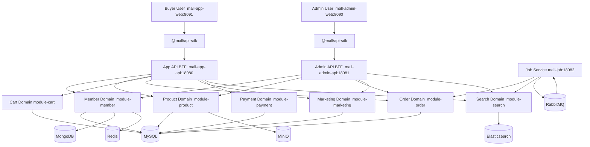
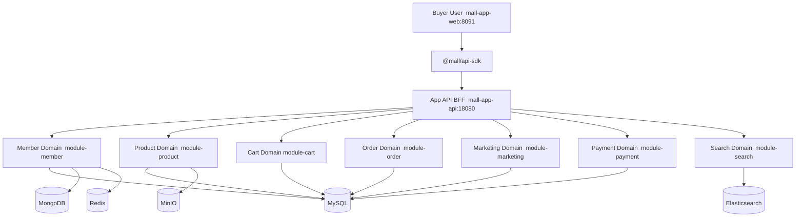
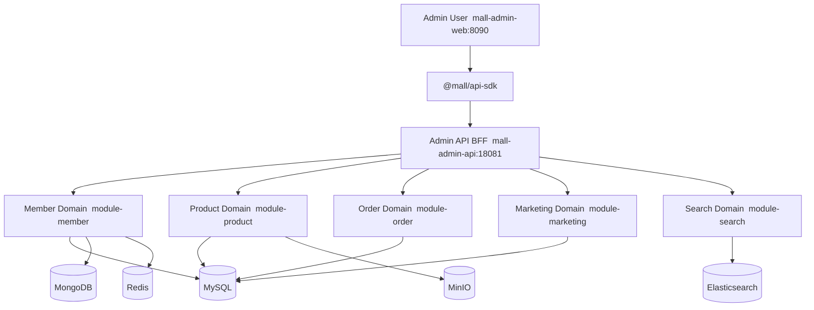
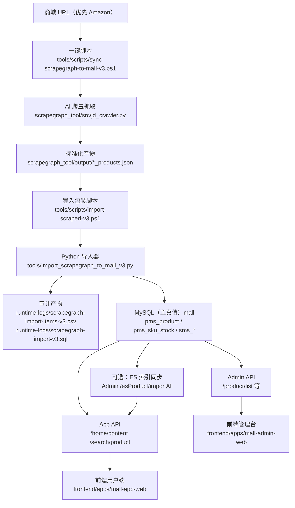

# Mall V3 — 全域重构（开发与维护手册）

> 文档导航：统一入口见 [docs/README.md](docs/README.md)。

> 文档目标：让新接手同学在最短时间内知道项目怎么跑、代码该去哪里改、线上/本地问题怎么查。  
> 本 README 重点覆盖：目录结构、关键文件职责、启动与排障、开发落点速查。

## Showcase

### 一句话价值

面向真实电商业务链路完成的全栈系统重构，强调可复现、可观测、可持续维护。

### 1分钟演示视频

- [demo.mp4](docs/showcase/pro_好物星球/demo.mp4)

### 3张关键截图

1. [shot-01.png（首页聚合）](docs/showcase/pro_好物星球/shot-01.png)
2. [shot-02.png（搜索/详情）](docs/showcase/pro_好物星球/shot-02.png)
3. [shot-03.png（管理端）](docs/showcase/pro_好物星球/shot-03.png)

### 一键运行命令

```powershell
pwsh -NoLogo -NoProfile -ExecutionPolicy Bypass -File .\scripts\preflight-v3.ps1
pwsh -NoLogo -NoProfile -ExecutionPolicy Bypass -File .\scripts\start-v3.ps1 -Frontend
```

### 核心技术决策

1. 双端 BFF 拆分 App/Admin 聚合层，减少前端与领域服务耦合。
2. 搜索链路提供 ES -> MySQL 自动降级策略，优先保障可用性。
3. 脚本体系统一为 PowerShell 7，降低多环境执行偏差。

### 性能/稳定性证据

- 证据页：[evidence.md](docs/showcase/pro_好物星球/evidence.md)
- 建议展示指标：首屏渲染时间、接口 P95、降级路径成功率。

### 面试可提问点

1. 你如何定义 BFF 与领域模块的边界？
2. 你做过哪些首屏性能优化，如何验证生效？
3. 如果迁移到云原生，最先拆解哪一层？

---

## 0. 导航目录（建议先看）

1. [项目一眼看懂](#1-项目一眼看懂)
2. [技术栈](#2-技术栈)
3. [端口与服务总览](#3-端口与服务总览维护必看)
4. [快速开始](#4-快速开始新同学推荐流程)
5. [目录结构与职责](#5-项目目录结构与职责详细版)
6. [后端结构](#6-后端结构与文件职责backend)
7. [前端结构](#7-前端结构与文件职责frontend)
8. [数据与配置](#8-数据与配置data--applicationyml)
9. [脚本与日志](#9-脚本与日志维护速查)
10. [测试体系](#10-测试体系避免测了但没测到)
11. [开发任务落点](#11-常见开发任务应该改哪些文件)
12. [维护排障](#12-维护排障手册值班常用)
13. [不可手改目录](#13-不要手改的目录与产物)
14. [模块边界规则](#14-模块边界规则必须遵守)
15. [文档索引与参考](#15-文档索引与参考)
16. [维护建议](#16-维护建议给后续接手同学)
17. [ScrapeGraph 导入链路](#17-scrapegraph-自动抓取与商品入库新手重点)
18. [PM 视角主链路](#18-项目经理视角端到端主链路mermaid--详细说明)
19. [环境基线与前置依赖](#19-环境基线与前置依赖按脚本与配置校对)
20. [脚本真实行为说明](#20-脚本真实行为说明避免误解参数)
21. [迁移与初始化真相](#21-数据迁移与初始化真相按当前代码事实)
22. [API 覆盖现状与差异](#22-api-覆盖现状与契约差异按当前文档事实)
23. [测试与 CI 现状](#23-测试与-ci-现状以及上线前最小门禁)
24. [安全基线与红线](#24-安全基线与红线按当前实现)
25. [已知风险与待补清单](#25-已知风险与待补文档清单)
26. [文档治理规则](#26-文档治理规则与更新触发矩阵)

---

## 1. 项目一眼看懂

Mall V3 是一个前后端分离的商城系统，整体分三层：

1. 展示与入口层：`frontend/apps/*` + `backend/mall-app-api` + `backend/mall-admin-api`
2. 业务能力层：`backend/mall-modules/*`（商品、订单、会员、营销、支付、搜索、购物车）
3. 公共与基础设施层：`backend/mall-shared/*` + `infra/docker-compose.local.yml`

请求主链路：

1. 前端页面（Vue）调用 `@mall/api-sdk`
2. SDK 请求 BFF（App API / Admin API）
3. BFF 调用业务模块 Service
4. 业务模块访问 MySQL / Redis / MongoDB / ES / RabbitMQ 等

---

## 1.1 一页纸业务逻辑图（V3）


业务主流程（简版）：

1. 用户注册登录：`/sso/register`、`/sso/login`，JWT 由 `shared-security` 统一处理。
2. 首页与搜索：`/home/content` 聚合首页数据，`/search/product` 走 ES 检索。
3. 交易主链路：商品详情 -> 加购 -> `/order/confirm` -> `/order/generateOrder` -> `/payment/create` -> 订单状态流转。
4. 会员行为：浏览记录/收藏/关注使用 `module-member` + MongoDB。
5. 管理后台：商品、订单、营销运营，并通过 `/esProduct/importAll`、`/esProduct/create/{id}` 维护 ES 索引。
6. 异步任务：`mall-job` 消费 RabbitMQ，处理超时取消与 ES 同步消费逻辑。




## 2. 技术栈

| 层面 | 技术 |
|------|------|
| 后端 | Java 17, Spring Boot 3.3.5, Spring Security 6, MyBatis-Plus 3.5.8 |
| 前端 | Vue 3.5, TypeScript 5.9, Vite 7, Pinia 3, pnpm monorepo |
| 数据与中间件 | MySQL 8.0, Redis 7, Elasticsearch 7.17.21, RabbitMQ 3.9, MongoDB 4, MinIO |
| 迁移与文档 | Flyway, springdoc-openapi (OpenAPI 3) |
| 测试 | JUnit5, TestContainers, MockMvc, Playwright |

---

## 3. 端口与服务总览（维护必看）

### 3.1 业务服务

| 服务 | 默认端口 | 健康检查 | 说明 |
|------|---------:|----------|------|
| App API | `18080` | `http://localhost:18080/actuator/health` | C 端 BFF |
| Admin API | `18081` | `http://localhost:18081/actuator/health` | 管理端 BFF |
| Job | `18082` | `http://localhost:18082/actuator/health` | 消费 MQ / 定时任务 |
| Mall App Web | `8091` | `http://localhost:8091` | C 端前端 |
| Mall Admin Web | `8090` | `http://localhost:8090` | 管理后台前端 |

### 3.2 基础设施（Docker Compose）

| 组件 | 端口 | 说明 |
|------|------|------|
| MySQL | `13306` | 主业务库 `mall` |
| Redis | `16379` | 缓存、验证码、token 黑名单 |
| MongoDB | `27018` | 会员行为数据（浏览/收藏/关注） |
| RabbitMQ | `5673` / `15673` | 异步消息 / 管理台 |
| Elasticsearch | `9201` / `9301` | 商品搜索 |
| MinIO | `19090` / `19001` | 文件与图片 |

### 3.3 常用访问地址（值班速查）

| 名称 | 地址 |
|------|------|
| App API 健康检查 | `http://localhost:18080/actuator/health` |
| Admin API 健康检查 | `http://localhost:18081/actuator/health` |
| Job 健康检查 | `http://localhost:18082/actuator/health` |
| App API OpenAPI | `http://localhost:18080/v3/api-docs` |
| Admin API OpenAPI | `http://localhost:18081/v3/api-docs` |
| App 前端 | `http://localhost:8091` |
| Admin 前端 | `http://localhost:8090` |
| RabbitMQ 管理台 | `http://localhost:15673` |
| MinIO Console | `http://localhost:19001` |

---

## 4. 快速开始（新同学推荐流程）

> **前端默认使用生产静态服务（TTI<3s）**。dev 模式（HMR）仅在需要实时热更新时使用。

### 4.1 首次启动（推荐）

```powershell
# 1) 环境预检查
.\scripts\preflight-v3.ps1

# 2) 启动基础设施 + 初始化数据库（仅首次）
.\scripts\start-v3.ps1
.\scripts\init-db.ps1 -SeedProfile minimal

# 3) 启动后端 + 生产前端（TTI<3s，日常使用此命令）
.\scripts\restart.ps1 -Prod
```

种子档位建议命令（PowerShell 7）：

```powershell
# 演示模式（默认）
pwsh -NoLogo -NoProfile -ExecutionPolicy Bypass -File .\scripts\init-db.ps1 -SeedProfile minimal

# 完整模式（本地扩展 seed 包）
pwsh -NoLogo -NoProfile -ExecutionPolicy Bypass -File .\scripts\init-db.ps1 -SeedProfile full
```

或直接使用交互菜单（推荐）：

```powershell
.\scripts\menu.ps1   # 选 1  → 全栈重启（生产前端）
                     # 选 39 → 首次完整初始化（含基础设施，dev 前端）
```

### 4.2 日常开发快速命令

| 场景 | 命令 |
|------|------|
| **改了后端代码** | `.\scripts\restart-be.ps1` |
| **改了前端代码** | `.\scripts\start-fe-prod.ps1 -SkipBuild` |
| **前后端都改了** | `.\scripts\restart.ps1 -Prod` |
| **需要前端 HMR** | `.\scripts\restart-fe.ps1` |
| **仅启动生产前端** | `.\scripts\start-fe-prod.ps1` |
| **查看服务状态** | `.\scripts\status.ps1` |

### 4.3 常用停止命令

```powershell
# 停止后端+前端+基础设施
.\scripts\stop-v3.ps1

# 仅停应用，不停基础设施
.\scripts\stop-v3.ps1 -KeepInfra

# 仅停生产前端
.\scripts\stop-fe-prod.ps1
```

### 4.4 常用脚本参数

| 脚本 | 参数 | 作用 |
|------|------|------|
| `restart.ps1` | `-Prod` | 生产前端模式（★ 默认推荐） |
| `restart.ps1` | `-SkipBuild` | 跳过 Maven 构建（使用已有 JAR） |
| `restart.ps1` | `-SkipFrontend` | 只重启后端 |
| `start-v3.ps1` | `-SkipBuild` | 跳过 Maven 构建（使用已有 jar） |
| `start-v3.ps1` | `-SkipInfra` | 不启动 Docker 基础设施 |
| `start-v3.ps1` | `-Frontend` | 同时启动两套前端（dev 模式） |
| `init-db.ps1` | `-Reset` | 重建数据库后再导入 |
| `init-db.ps1` | `-SeedOnly` | 仅导入 seed 数据 |
| `init-db.ps1` | `-SeedProfile minimal` | GitHub 展示默认：仅导入 `V100` + `V101` |
| `init-db.ps1` | `-SeedProfile full` | 导入 `data/seed/*.sql` 全量（需本地扩展 seed 包） |

### 4.5 默认账号

1. 管理员：`admin / macro123`（来自 `data/seed/V100__seed_admin_and_base_data.sql`）
2. 会员：默认不内置账号，建议通过注册页或接口自行注册

---

## 5. 项目目录结构与职责（详细版）

> 说明：以下为“当前仓库实际结构”。  
> 维护建议：遇到冲突时，以代码和脚本为准，文档为辅。

```text
project_mall_v3/
├─ .github/
├─ .gitignore
├─ AGENTS.md
├─ backend/
├─ CONTRIBUTING.md
├─ data/
├─ docs/
├─ frontend/
├─ infra/
├─ README.md
├─ runtime-logs/
├─ scripts/
├─ tests/
└─ tools/
```

### 5.1 顶层目录职责速查

| 路径 | 作用 | 维护建议 |
|------|------|----------|
| `.github/workflows/ci.yml` | CI 流水线（后端编译测试 + 前端构建） | 改构建流程时修改 |
| `.gitignore` | 版本控制忽略规则（`.class`、`target/`、`node_modules/` 等） | 新增需忽略的产物时修改 |
| `AGENTS.md` | AI 代理执行约束与策略 | AI 辅助开发规则变更时修改 |
| `CONTRIBUTING.md` | 贡献快速入门（指向 `docs/11_contributing.md` 完整版） | 协作流程变更时修改 |
| `backend/` | Java 后端多模块源码 | 后端业务变更主战场 |
| `frontend/` | pnpm monorepo 前端工程 | 页面/交互/API 对接主战场 |
| `data/` | SQL 迁移与种子 | 数据结构和初始化数据 |
| `infra/` | 本地 Docker 依赖编排 | 改中间件版本或端口时修改 |
| `scripts/` | 启停、检查、初始化脚本 | 运维和本地排障核心入口 |
| `tests/` | 独立黑盒/灰盒测试 | 服务启动后冒烟验证 |
| `tools/` | ScrapeGraph 导入工具链 | 抓取数据入库商城的唯一入口 |
| `docs/` | 架构、合同、迁移、发布文档 | 理解历史决策与规范 |
| `runtime-logs/` | 运行日志和 PID 记录 | 排障看这里，不要提交产物 |

---

## 6. 后端结构与文件职责（`backend/`）

### 6.1 模块总览

```text
backend/
├─ pom.xml                    # Maven 聚合根（统一版本、模块列表）
├─ mvnw / mvnw.cmd            # Maven Wrapper
├─ mall-shared/               # 共享能力层
│  ├─ shared-common/
│  ├─ shared-security/
│  ├─ shared-web/
│  └─ shared-test/
├─ mall-modules/              # 业务模块层
│  ├─ module-member/
│  ├─ module-product/
│  ├─ module-cart/
│  ├─ module-order/
│  ├─ module-marketing/
│  ├─ module-payment/
│  └─ module-search/
├─ mall-app-api/              # App BFF (18080)
├─ mall-admin-api/            # Admin BFF (18081)
└─ mall-job/                  # Job 服务 (18082)
```

### 6.2 shared 层（可复用底座）

| 模块 | 关键职责 | 关键文件 |
|------|----------|----------|
| `shared-common` | 统一返回体、分页、异常、Redis、验证码服务 | `common/api/CommonResult.java`, `common/api/CommonPage.java`, `common/service/RedisService.java`, `common/service/AuthCodeService.java` |
| `shared-security` | JWT、黑名单、动态权限、认证异常处理 | `security/filter/JwtAuthFilter.java`, `security/service/JwtService.java`, `security/service/TokenBlacklistService.java`, `security/component/DynamicResourcePermissionService.java` |
| `shared-web` | 全局异常、CORS、Jackson、MyBatis Plus 分页配置、Swagger 基类 | `web/exception/GlobalExceptionHandler.java`, `web/config/CorsConfig.java`, `web/config/JacksonConfig.java`, `web/config/MybatisPlusConfig.java` |
| `shared-test` | TestContainers 与测试基类 | `test/AbstractIntegrationTest.java`, `test/AbstractMvcIntegrationTest.java`, `resources/sql/schema-test.sql` |

### 6.3 业务模块层（module-*）

| 模块 | 领域 |
|------|------|
| `module-member` | 注册登录、会员地址、浏览记录、收藏、关注（MySQL + Mongo） |
| `module-product` | 商品、品牌、分类、属性、SKU |
| `module-cart` | 购物车增删改查与促销信息 |
| `module-order` | 下单、订单状态流转、退货申请、订单设置 |
| `module-marketing` | 优惠券、秒杀、首页广告与推荐 |
| `module-payment` | 支付抽象与 Mock 支付日志 |
| `module-search` | Elasticsearch 商品搜索与索引读写 |

### 6.4 BFF 与 Job

| 模块 | 作用 | 关键入口 |
|------|------|----------|
| `mall-app-api` | 面向 C 端聚合 API | `MallAppApiApplication.java` |
| `mall-admin-api` | 面向管理后台聚合 API | `MallAdminApiApplication.java` |
| `mall-job` | RabbitMQ 消费与异步任务 | `MallJobApplication.java` |

Job 关键文件：

1. `mall-job/src/main/java/com/mall/job/config/RabbitMqConfig.java`
2. `mall-job/src/main/java/com/mall/job/consumer/OrderCancelConsumer.java`
3. `mall-job/src/main/java/com/mall/job/consumer/EsProductSyncConsumer.java`

### 6.5 后端常见目录命名规则（新人必读）

| 目录 | 意义 |
|------|------|
| `controller/` | HTTP 接口层，做参数接收与响应包装 |
| `service/` | 业务接口 |
| `service/impl/` | 业务实现（核心逻辑） |
| `mapper/` | MyBatis-Plus 数据访问层 |
| `entity/` | 数据库实体 |
| `dto/` | 入参/出参模型 |
| `config/` | 安全、Swagger、Bean 配置 |
| `src/main/resources/application.yml` | 本模块运行配置 |
| `src/test/` | 模块内单元/集成测试 |

---

## 7. 前端结构与文件职责（`frontend/`）

### 7.1 monorepo 结构

```text
frontend/
├─ package.json               # workspace 顶层脚本
├─ pnpm-workspace.yaml        # 管理 apps/* + packages/*
├─ packages/
│  └─ api-sdk/                # 前后端 API 封装
└─ apps/
   ├─ mall-app-web/           # C 端前端
   ├─ mall-admin-web/         # 管理后台前端
   └─ e2e/                    # Playwright E2E
```

### 7.2 关键文件

| 路径 | 作用 |
|------|------|
| `frontend/package.json` | 顶层命令：`dev:app`、`dev:admin`、`build:*`、`type-check` |
| `frontend/packages/api-sdk/src/index.ts` | Axios 实例、token 注入、统一导出 API |
| `frontend/packages/api-sdk/src/app/*.ts` | C 端 API 定义 |
| `frontend/packages/api-sdk/src/admin/*.ts` | 管理端 API 定义 |
| `frontend/apps/mall-app-web/src/router/index.ts` | C 端路由和登录守卫 |
| `frontend/apps/mall-admin-web/src/router/index.ts` | 管理端路由和登录守卫 |
| `frontend/apps/mall-app-web/src/views/*.vue` | C 端页面 |
| `frontend/apps/mall-admin-web/src/views/**/*.vue` | 管理端页面 |
| `frontend/apps/e2e/tests/*.spec.ts` | E2E 黄金路径脚本 |

### 7.3 前端维护注意事项

1. 业务改动优先修改 `.vue`、`.ts` 源文件。
2. `src/**/*.vue.js`、`src/main.js`、`src/router/index.js` 多为生成/辅助产物，通常不作为主修改入口。
3. 端口以 Vite 配置为准：
   - `mall-admin-web`: `8090`
   - `mall-app-web`: `8091`

---

## 8. 数据与配置（`data/` + `application.yml`）

### 8.1 SQL 文件职责

| 文件 | 作用 |
|------|------|
| `data/migration/V1__baseline.sql` | 基线占位 |
| `data/migration/V2__v3_schema_additions.sql` | V3 新增列/表 |
| `data/migration/V3__default_order_setting.sql` | 默认订单设置 |
| `data/migration/V5__product_blob_tables.sql` | 商品图片 BLOB 与内容归档表（含字段扩容） |
| `data/seed/V100__seed_admin_and_base_data.sql` | 基础管理数据 |
| `data/seed/V101__seed_sample_products.sql` | 示例商品与运营数据 |
| `data/seed/V102__seed_huawei_watch_gt6.sql` | 华为 GT6 深度集成数据（扩展包，默认不随 GitHub 主仓库分发） |
| `data/seed/V103__seed_products_batch.sql` | 批量商品样例数据（扩展包，默认不随 GitHub 主仓库分发） |

GitHub 展示仓库默认仅保留最小可运行 seed（`V100` + `V101`）。`V102`/`V103` 作为可选扩展数据，按需在本地补充。

### 8.2 后端配置文件职责

| 文件 | 作用 |
|------|------|
| `backend/mall-app-api/src/main/resources/application.yml` | App BFF 配置 |
| `backend/mall-admin-api/src/main/resources/application.yml` | Admin BFF 配置 |
| `backend/mall-job/src/main/resources/application.yml` | Job 配置 |

重点字段：

1. `server.port`：服务端口
2. `spring.datasource`：MySQL
3. `spring.data.redis`：Redis
4. `spring.data.mongodb`：MongoDB
5. `spring.elasticsearch.uris`：ES
6. `spring.rabbitmq`：MQ
7. `mall.auth.jwt-secret`：JWT 密钥（支持环境变量）

---

## 9. 脚本与日志（维护速查）

### 9.1 脚本职责

| 脚本 | 作用 |
|------|------|
| `scripts/preflight-v3.ps1` | 检查 Java/Maven/Docker/Node/pnpm/端口占用 |
| `scripts/start-v3.ps1` | 启动 infra + backend + 可选 frontend（dev 模式），带健康检查 |
| `scripts/stop-v3.ps1` | 停止进程与容器，支持强制端口清理 |
| `scripts/restart.ps1` | **一键重启全栈，`-Prod` 使用生产前端（★ 日常推荐）** |
| `scripts/restart-be.ps1` | 重启后端服务，自动检测代码变化决定是否构建 |
| `scripts/restart-fe.ps1` | 重启前端 dev 服务器（HMR，TTI 30s+，仅开发用） |
| `scripts/start-fe-prod.ps1` | 构建并启动生产前端静态服务（TTI<3s，同源代理） |
| `scripts/stop-fe-prod.ps1` | 停止生产前端静态服务 |
| `scripts/build-be.ps1` | 单独构建后端（不重启），支持 `-Clean`、`-Test`、`-Module` |
| `scripts/init-db.ps1` | 导入 migration/seed，支持重置 |
| `scripts/run-tests.ps1` | 执行根目录黑盒契约/集成测试 |
| `scripts/check-docs.ps1` | 校验仓库 Markdown frontmatter 规范 |
| `scripts/menu.ps1` | 交互菜单，覆盖所有操作，输入编号回车执行 |

### 9.2 日志与 PID

日志目录：`runtime-logs/`

常见文件：

1. `mall-app-api.log`
2. `mall-admin-api.log`
3. `mall-job.log`
4. `mall-app-web.log`
5. `mall-admin-web.log`
6. `backend-pids.txt`
7. `frontend-pids.txt`

示例查看命令：

```powershell
Get-Content .\runtime-logs\mall-app-api.log -Tail 200
Get-Content .\runtime-logs\mall-admin-api.log -Tail 200
```

---

## 10. 测试体系（避免“测了但没测到”）

### 10.1 模块内测试（Maven 生命周期内）

路径：`backend/*/src/test/**`  
执行：`cd backend && .\mvnw.cmd test`

### 10.2 根目录 tests（独立黑盒）

路径：`tests/contract`、`tests/integration`  
执行：`.\scripts\run-tests.ps1`  
说明：这部分不在 Maven `modules` 里，不会被 `mvn test` 自动执行。

### 10.3 前端 E2E

路径：`frontend/apps/e2e`  
执行：

```powershell
cd frontend
pnpm test:e2e
```

---

## 11. 常见开发任务：应该改哪些文件

| 任务 | 推荐落点 |
|------|----------|
| 新增 App 接口 | `backend/mall-app-api/src/main/java/com/mall/app/controller/*` + 对应 `module-*/service/*` + `frontend/packages/api-sdk/src/app/*` |
| 新增 Admin 接口 | `backend/mall-admin-api/src/main/java/com/mall/admin/controller/*` + 对应 `module-*/service/*` + `frontend/packages/api-sdk/src/admin/*` |
| 调整鉴权策略 | `backend/mall-app-api/src/main/java/com/mall/app/config/SecurityConfig.java` / `backend/mall-admin-api/src/main/java/com/mall/admin/config/SecurityConfig.java` + `shared-security/*` |
| 调整全局异常返回 | `backend/mall-shared/shared-web/src/main/java/com/mall/web/exception/GlobalExceptionHandler.java` |
| 新增数据库字段 | `data/migration/V{next}__*.sql` + 对应 `entity/dto/service` |
| 修改前端页面 | `frontend/apps/*/src/views/**/*.vue` |
| 修改前端接口地址/签名 | `frontend/packages/api-sdk/src/**/*.ts` |
| 搜索相关改动 | `backend/mall-modules/module-search/*` + `backend/mall-admin-api/src/main/java/com/mall/admin/controller/EsProductController.java` |
| 支付链路改动 | `backend/mall-modules/module-payment/*` + `backend/mall-app-api/src/main/java/com/mall/app/controller/PaymentController.java` |

---

## 12. 维护排障手册（值班常用）

### 12.1 启动失败：端口占用

处理步骤：

1. 执行 `.\scripts\stop-v3.ps1 -ForcePortKill`
2. 再执行 `.\scripts\start-v3.ps1 -Frontend`

### 12.2 Docker 相关失败

1. 先确认 Docker Desktop 已启动
2. 执行 `docker ps` 确认容器状态
3. 必要时重建：

```powershell
cd .\infra
docker compose -f docker-compose.local.yml down --remove-orphans
docker compose -f docker-compose.local.yml up -d
```

### 12.3 接口 401 / 403

排查顺序：

1. token 是否存在（浏览器 localStorage）
2. `Authorization` 头是否为 `Bearer <token>`
3. App/Admin 是否请求到正确 BFF 端口
4. Admin 的 RBAC 资源配置是否命中（`DynamicResourcePermissionService`）

### 12.4 登录失败

1. 先确认是否已执行 `.\scripts\init-db.ps1`
2. 管理员默认账号：`admin / macro123`
3. 普通会员请先注册

### 12.5 ES 搜索无结果

1. 确认 ES 容器健康（`http://localhost:9201/_cluster/health`）
2. 在 Admin 调用 ES 导入接口后再搜索（`/esProduct/importAll`）
3. 检查 Job 与搜索模块日志

---

## 13. 不要手改的目录与产物

以下目录/文件通常是构建产物或运行产物，除非你明确知道在做什么，否则不要手改：

1. `**/target/**`
2. `**/node_modules/**`
3. `**/dist/**`
4. `runtime-logs/**`
5. `**/*.tsbuildinfo`

---

## 14. 模块边界规则（必须遵守）

1. `mall-app-api` / `mall-admin-api` 只做 BFF 聚合，不承载重业务逻辑。
2. 业务逻辑下沉到 `mall-modules/*`，模块间通过 Service 调用，不做跨模块直接查表。
3. `shared-*` 只能被依赖，不能反向依赖业务模块。
4. 前端 `localStorage` 只存 token，不存业务真值数据。
5. Controller 只做参数和路由；核心业务逻辑放 Service。

---

## 15. 文档索引与参考

### 15.1 全局文档（`docs/`）

1. `docs/README.md`：文档中心与导航入口
2. `docs/00_architecture.md`：架构蓝图
3. `docs/01_roadmap.md`：路线图与里程碑
4. `docs/02_api_contract.md`：App/Admin 接口契约
5. `docs/03_data_migration.md`：数据迁移策略
6. `docs/04_release_runbook.md`：发布运行手册
7. `docs/05_backend_frontend_api_usage.md`：App 前端与后端调用映射
8. `docs/06_doc_style.md`：文档格式规范
9. `docs/07_module_inventory_and_doc_gap.md`：模块盘点与文档缺口
10. `docs/08_glossary.md`：术语表
11. `docs/09_error_handling.md`：错误处理指南
12. `docs/10_security_guide.md`：安全指南
13. `docs/11_contributing.md`：贡献指南
14. `docs/12_adr_log.md`：架构决策记录 ADR

### 15.2 模块文档（就近维护）

1. `backend/README.md`
2. `backend/mall-modules/README.md`
3. `frontend/README.md`
4. `infra/README.md`
5. `data/README.md`
6. `scripts/README.md`
7. `tests/README.md`
8. `tools/README.md`
9. `.github/README.md`
10. `runtime-logs/README.md`

---

## 16. 维护建议（给后续接手同学）

1. 每次改动先定位落点：先看 README 第 11 节，再改代码。
2. 每次提测至少跑一次：模块内测试 + `scripts/run-tests.ps1`。
3. 发生线上/本地故障时，先看 `runtime-logs/`，再看端口和容器状态。
4. 修改数据库结构必须新增 migration SQL，不要直接手改线上表。

---

## 17. ScrapeGraph 自动抓取与商品入库（新手重点）

这一节专门回答三个问题：

1. `scrapegraph_tool` 能做什么？
2. 抓到的商品数据最终存在哪里？
3. 怎么把抓取结果稳定导入 `mall_v3`，让后台和前端都看得到？

### 17.1 `scrapegraph_tool` 能力边界

`scrapegraph_tool`（仓库同级目录）主要做“网页商品信息采集与标准化输出”，不直接改商城数据库。

关键文件：

- `scrapegraph_tool/src/jd_crawler.py`：抓取入口，支持 `jd`、`taobao`、`pdd`、`amazon`、`generic`。
- `scrapegraph_tool/prompts/jd_products_prompt.txt`：定义结构化输出字段（商品名、链接、价格、图片、属性等）。
- `scrapegraph_tool/src/save_storage_state.py`：保存登录态和 cookie（应对反爬或登录后页面）。

抓取产物默认在 `scrapegraph_tool/output/`：

- `*_raw.json`：原始抓取结果
- `*_products.json`：标准化商品数组（导入首选）
- `*.xlsx`：扁平化表格
- `*.csv`：可选导出（`--with-csv`）

结论：`scrapegraph_tool` 负责“采集和清洗”；`project_mall_v3/tools/*` 负责“入库和上架可见”。

### 17.2 商城商品数据到底存哪里？

不是“随便存”，而是有明确分层：

1. MySQL（主存储，唯一业务真值）
   - 连接：`localhost:13306`
   - 库名：`mall`
   - 容器：`mallv3-mysql`
   - 商品核心表：`pms_product`
   - SKU 表：`pms_sku_stock`
   - 营销展示表：`sms_home_new_product`、`sms_home_recommend_product`、`sms_home_advertise`、`sms_flash_promotion_product_relation`
2. Elasticsearch（搜索索引，不是主真值）
   - 连接：`http://localhost:9201`
   - 用于商品搜索；数据来源仍是 MySQL 导出的索引副本。
3. MongoDB（会员行为数据）
   - 连接：`mongodb://localhost:27018/mall`
   - 用于浏览记录、收藏、关注等行为，不作为商品主数据存储。

### 17.3 已在 V3 新增的导入工具

本项目已新增以下文件：

- `tools/import_scrapegraph_to_mall_v3.py`
- `tools/scripts/import-scraped-v3.ps1`
- `tools/scripts/sync-scrapegraph-to-mall-v3.ps1`
- `tools/README.md`（tools 目录统一说明）

它们的作用：

1. 读取 `*_products.json` 或 `*.csv`
2. 字段归一化（标题、价格、图片、品牌、类目、详情）
3. 生成导入 SQL（审计可追溯）
4. 可选直接执行到 `mallv3-mysql`
5. 自动补充首页新品、热门推荐、广告位、秒杀关联

### 17.4 一眼可用的标准流程（推荐）

先确保基础环境可用：

```powershell
cd d:/Desktop/work/mall/project_mall_v3
./scripts/start-v3.ps1
./scripts/init-db.ps1
```

方案 A：已经有 `*_products.json`，直接导入

```powershell
cd d:/Desktop/work/mall/project_mall_v3
./tools/scripts/import-scraped-v3.ps1 `
  -InputPath "d:/Desktop/work/mall/scrapegraph_tool/output/your_products.json"
```

方案 B：抓取 + 导入一步完成

```powershell
cd d:/Desktop/work/mall/project_mall_v3
./tools/scripts/sync-scrapegraph-to-mall-v3.ps1 `
  -Url "https://www.amazon.com/s?k=wireless+mouse" `
  -Site amazon `
  -MaxPages 10
```

方案 C：只生成 SQL 和审计文件，不立即写库

```powershell
cd d:/Desktop/work/mall/project_mall_v3
./tools/scripts/import-scraped-v3.ps1 `
  -InputPath "d:/Desktop/work/mall/scrapegraph_tool/output/your_products.json" `
  -SkipMysql
```

导入过程会输出：

- `runtime-logs/scrapegraph-import-items-v3.csv`
- `runtime-logs/scrapegraph-import-v3.sql`

### 17.5 抓取字段到商城字段的落库映射（核心）

常见映射关系：

- `product_name` -> `pms_product.name`
- `product_url` -> `pms_product.note` 和 `pms_product.detail_html` 中的来源信息
- `price` -> `pms_product.price` 和 `pms_sku_stock.price`
- `original_price` -> `pms_product.original_price`
- `main_image` 和 `images` -> `pms_product.pic` 和 `pms_product.album_pics`
- `brand` 和 `shop_name` -> `pms_brand` + `pms_product.brand_id/brand_name`
- `category_path` -> `pms_product.product_category_name`（同时挂到导入类目）
- `description` 和 `attributes` -> `pms_product.detail_desc/detail_html`

### 17.6 导入后为什么后台和前端能看到？

因为导入脚本会把商品写成“可发布状态”：

- `publish_status = 1`
- `new_status = 1`
- `recommand_status = 1`

并同步写入首页营销表（新品、推荐、广告、秒杀关联）。

展示链路：

1. 抓取 JSON -> MySQL 商品和营销表
2. Admin API 查询并管理
3. App API 和前端页面读取展示
4. 若走搜索，执行一次 ES 全量导入后即可在搜索结果出现

### 17.7 导入完成后的快速验收 SQL

```sql
SELECT COUNT(*) AS product_cnt FROM pms_product;
SELECT COUNT(*) AS sku_cnt FROM pms_sku_stock;
SELECT COUNT(*) AS home_new_cnt FROM sms_home_new_product;
SELECT COUNT(*) AS home_recommend_cnt FROM sms_home_recommend_product;
SELECT COUNT(*) AS home_banner_cnt FROM sms_home_advertise WHERE note = 'scrapegraph-banner';
```

### 17.8 维护注意事项（避免脏导入）

1. 先小批量验证再放大（`-MaxPages 5` 或 `10`）。
2. 价格缺失会走默认价（可通过 `-DefaultPrice` 调整）。
3. 重复商品按 `item_key` 或商品编号去重，已有商品会更新而不是无限新增。
4. 搜索无结果时，先确认 ES 健康，再执行 `/esProduct/importAll`。
5. 反爬站点优先用 `save_storage_state.py` 保存登录态，再通过 `-PlaywrightStorageState` 传入抓取脚本。

## 18. 项目经理视角：端到端主链路（Mermaid + 详细说明）

一句话主链路：

`商城URL -> AI爬虫抓取 -> 标准化商品JSON -> 导入MySQL -> 后端API聚合 -> 前端页面展示`

### 18.1 主流程图（可直接用于评审/交接）



### 18.2 系统边界（谁对什么结果负责）

1. 采集层：`scrapegraph_tool` 负责“从网页提取商品信息并结构化输出文件”，不直接写商城库。
2. 导入层：`project_mall_v3/tools` 负责“字段清洗、去重、生成 SQL、入库、补营销位”。
3. 服务层：`backend` 负责“把 MySQL 数据组织成 App/Admin API”。
4. 展示层：`frontend` 负责“消费 API 并呈现页面”，不直连数据库。
5. 搜索层：ES 仅为检索索引，不是商品主真值；主真值始终是 MySQL。

### 18.3 按阶段拆解（输入/处理/输出/验收）

1. 抓取阶段
   - 输入：商城 URL（推荐 Amazon 列表页或详情页）。
   - 处理：`sync-scrapegraph-to-mall-v3.ps1` 调 `jd_crawler.py`，传 `--engine deepseek --url --site --max-pages`。
   - 输出：`scrapegraph_tool/output/*_products.json`。
   - 验收：确认输出文件存在且条目数符合预期。

2. 导入准备阶段
   - 输入：`*_products.json`（或 `*.csv`）。
   - 处理：`import-scraped-v3.ps1` 调 `import_scrapegraph_to_mall_v3.py`，支持 `--default-price --banner-limit --flash-limit --skip-mysql`。
   - 输出：导入参数确定、待执行 SQL 生成。
   - 验收：脚本启动成功，参数生效。

3. 数据清洗与映射阶段
   - 输入：原始商品字段（标题、价格、图片、品牌、类目、描述等）。
   - 处理：标准化字段、补默认值、按 `item_key` 去重，优先保留信息更完整项。
   - 输出：统一的 `ImportItem` 集合。
   - 验收：空标题、缺图、缺价比例在可接受阈值内。

4. 入库与上架阶段
   - 输入：清洗后的导入项和 SQL。
   - 处理：写入/更新 `pms_product`、`pms_sku_stock`、`sms_home_new_product`、`sms_home_recommend_product`、`sms_home_advertise` 等表；同时设置 `publish_status=1`、`new_status=1`、`recommand_status=1`。
   - 输出：商品主数据与首页营销数据可见。
   - 验收：后台商品列表可查，前台首页有新品/热门/轮播。

5. API 聚合阶段
   - 输入：MySQL 商品与营销数据。
   - 处理：App API 通过 `/home/content` 聚合首页；搜索通过 `/search/product` 提供检索。
   - 输出：统一 API 响应结构。
   - 验收：接口 200，字段完整，响应时间在 SLA 范围内。

6. 前端展示阶段
   - 输入：App/Admin API 返回的数据。
   - 处理：用户端渲染轮播、新品、热门；管理端展示商品列表并支持上下架/推荐操作。
   - 输出：业务可见页面。
   - 验收：页面可访问、数据与后台一致。

7. 搜索索引阶段（可选）
   - 输入：MySQL 商品数据。
   - 处理：调用 Admin 接口 `/esProduct/importAll` 建立/刷新 ES 索引。
   - 输出：ES 可检索数据。
   - 验收：搜索命中率恢复；若 ES 异常，`/search/product` 会回退 MySQL。

### 18.4 字段映射速查（PM 与研发对齐重点）

1. `product_name` -> `pms_product.name`
2. `product_url` -> `pms_product.note` + `pms_product.detail_html` 来源信息
3. `price` -> `pms_product.price` + `pms_sku_stock.price`
4. `original_price` -> `pms_product.original_price`
5. `main_image/images` -> `pms_product.pic` + `pms_product.album_pics`
6. `brand/shop_name` -> `pms_brand` + `pms_product.brand_id/brand_name`
7. `category_path` -> `pms_product.product_category_name`（并挂到导入类目）
8. `description/attributes` -> `pms_product.detail_desc/detail_html`

### 18.5 日常检查清单（项目经理必盯）

1. 是否产出最新 `*_products.json`（抓取成功率）。
2. 是否生成 `runtime-logs/scrapegraph-import-items-v3.csv` 和 `runtime-logs/scrapegraph-import-v3.sql`（可追溯性）。
3. 导入质量是否异常（空标题、缺价、缺图占比）。
4. 商品是否处于可见状态（发布/新品/推荐）。
5. `/home/content` 是否稳定有数据（首页可用性）。
6. `/search/product` 是否正常（ES 正常时走 ES；异常时回退 MySQL）。

### 18.6 标准执行口令（团队统一）

1. 只导入已有抓取文件：
```powershell
cd d:/Desktop/work/mall/project_mall_v3
./tools/scripts/import-scraped-v3.ps1 `
  -InputPath "d:/Desktop/work/mall/scrapegraph_tool/output/your_products.json"
```

2. 抓取 + 导入一步完成：
```powershell
cd d:/Desktop/work/mall/project_mall_v3
./tools/scripts/sync-scrapegraph-to-mall-v3.ps1 `
  -Url "https://www.amazon.com/s?k=wireless+mouse" `
  -Site amazon `
  -MaxPages 10
```

3. 只做审计不写库：
```powershell
cd d:/Desktop/work/mall/project_mall_v3
./tools/scripts/import-scraped-v3.ps1 `
  -InputPath "d:/Desktop/work/mall/scrapegraph_tool/output/your_products.json" `
  -SkipMysql
```

---

## 19. 环境基线与前置依赖（按脚本与配置校对）

### 19.1 必需与可选依赖

| 工具 | 要求 | 说明 |
|---|---|---|
| Java | `>=17`（必需） | 后端构建/运行必需 |
| Maven Wrapper | `backend/mvnw.cmd`（优先） | 若缺失回退系统 `mvn` |
| Docker Desktop | 已安装且 daemon 可用（必需） | 本地 MySQL/Redis/Mongo/ES/MQ/MinIO 都依赖 |
| Node.js | `>=20`（前端必需） | 仅后端联调可暂不装 |
| pnpm | `>=9`（前端必需） | 前端 workspace 命令依赖 |
| PowerShell | `>=5.1`（推荐） | 本仓库脚本主入口 |

### 19.2 一键预检命令

```powershell
cd d:/Desktop/work/mall/project_mall_v3
./scripts/preflight-v3.ps1
```

预检会做三类检查：

1. 基础工具链（Java/Maven/Docker/Node/pnpm）
2. Docker daemon 可用性
3. 关键端口占用（infra/backend/frontend）

---

## 20. 脚本真实行为说明（避免误解参数）

### 20.1 `start-v3.ps1` 不是“只启动”

核心行为（按当前脚本）：

1. 先跑 `preflight-v3.ps1`
2. 默认启动 `infra/docker-compose.local.yml`
3. 等待 MySQL/Redis/Elasticsearch 就绪
4. 后端按“源码指纹”决定是否重新 `mvnw clean package -DskipTests`
5. 启动 `mall-app-api`、`mall-admin-api`、`mall-job`
6. 可选 `-Frontend` 启动前端
7. 前端会从日志解析最终端口，若 8090/8091 冲突可能落到其他端口
8. 启动末尾会做一次“真实登录诊断”并打印可登录账号候选

### 20.2 `stop-v3.ps1` 的保护与风险

1. 默认先按 `runtime-logs/*-pids.txt` 停进程，再做端口/命令行兜底扫描
2. `-KeepInfra`：只停应用，不停 Docker 中间件
3. `-ForcePortKill`：强制清理已知端口监听（高风险，用于僵尸进程）
4. 会保护当前终端进程链，降低误杀 IDE 终端风险
5. 停止时会保留最新 18 个 `*.log`，清理更旧日志

### 20.3 `init-db.ps1` 的导入策略

1. 默认执行 `data/migration/*.sql` + `SeedProfile=minimal`（仅 `V100` + `V101`）
2. `-SeedProfile minimal`：导入最小演示数据集（GitHub 展示默认）
3. `-SeedProfile full`：导入 `data/seed/*.sql` 全量（依赖本地扩展 seed 包）
4. `-Reset`：先重建 `mall` 库再导入
5. `-SeedOnly`：跳过 migration，仅导入 seed
6. migration 任一失败会中断；seed 单文件失败会告警并继续

### 20.4 `run-tests.ps1` 的前置条件

1. 先检查 `18080` 和 `18081` 的 `/actuator/health`
2. 编译并运行两个入口：
   - `tests/contract/AppApiContractTest.java`
   - `tests/integration/OrderFlowIntegrationTest.java`
3. 这两组测试不在 Maven modules 内，不会被 `mvn test` 自动执行

### 20.5 `check-docs.ps1` 门禁范围

当前自动校验：

1. Markdown 必须有 frontmatter
2. 必填键：`owner/updated/scope/audience/doc_type`
3. `scope` 必须为 `mall-v3`

未自动校验（需人工 review）：

1. 标题层级
2. Mermaid 图语义
3. 术语一致性

---

## 21. 数据迁移与初始化真相（按当前代码事实）

### 21.1 `V1/V2/V3/V5` 的真实含义

1. `V1__baseline.sql`：仅基线占位（`SELECT 1`），不包含完整建表 DDL
2. `V2__v3_schema_additions.sql`：补列/补表（如 `oms_payment_log`）
3. `V3__default_order_setting.sql`：补默认订单配置
4. `V5__product_blob_tables.sql`：补商品图片 BLOB 存储、规格参数与内容归档表，并扩容 `album_pics/detail_mobile_html`

### 21.2 Docker 首次启动与后续启动的差异

1. `infra/docker-compose.local.yml` 将 `data/migration/` 挂到 MySQL `initdb.d`
2. 仅在“全新卷首次启动”自动执行
3. 非首次启动不会自动重复执行，需要手动跑 `init-db.ps1`

### 21.3 Flyway 状态（当前默认未启用）

`mall-app-api` 与 `mall-admin-api` 都存在 Flyway 配置，但 `enabled=false`。  
当前真实流程是：脚本执行 SQL 为主，不是应用启动自动迁移。

### 21.4 最小验收 SQL

```sql
SELECT COUNT(*) FROM information_schema.tables WHERE table_schema='mall';
SELECT COUNT(*) FROM ums_admin;
SELECT COUNT(*) FROM pms_product;
SELECT COUNT(*) FROM oms_payment_log;
```

---

## 22. API 覆盖现状与契约差异（按当前文档事实）

### 22.1 契约规模（2026-02-23 口径）

1. App API：64 个端点
2. Admin API：154 个端点

### 22.2 App 前端（`mall-app-web`）实际使用

1. 页面层唯一动作调用：36 个
2. 实际落到 App 后端接口：36 个
3. App 后端未被 `mall-app-web` 使用：28 个

### 22.3 当前已知契约差异（需关注）

1. 后端无 `/member/coupon/listByProduct/{productId}`，但 App SDK 仍保留该方法
2. Admin SDK 存在部分路径变量位置与后端注解不一致项（需按 Controller 契约收敛）

### 22.4 回归优先级建议

1. 权限链路：`/admin/login`、`/admin/logout`、`/role/*`、`/resource/*`
2. 商品链路：`/product/*`、`/brand/*`、`/sku/*`
3. 订单链路：`/order/*`、`/returnApply/*`
4. 搜索链路：`/esProduct/importAll`、`/search/product`

---

## 23. 测试与 CI 现状，以及上线前最小门禁

### 23.1 本地测试分层

1. 后端模块内测试：`backend/*/src/test/**`（`cd backend && ./mvnw.cmd test`）
2. 独立黑盒/灰盒：`tests/contract` + `tests/integration`（`./scripts/run-tests.ps1`）
3. 前端 E2E：`frontend/apps/e2e`（`cd frontend && pnpm test:e2e`）

### 23.2 CI 当前实际门禁

Backend Job：

1. `./mvnw compile`
2. `./mvnw test -pl mall-shared/shared-common,mall-shared/shared-security`
3. `./mvnw package -DskipTests`

Frontend Job：

1. `pnpm type-check`
2. `pnpm build:admin`
3. `pnpm build:app`

当前 CI 默认不包含：

1. 全量后端模块单测门禁
2. Playwright E2E 门禁
3. 前端 lint 门禁（当前工作区存在依赖缺口）

### 23.3 触发规则注意点

`.github/workflows/ci.yml` 使用：

1. `paths-ignore: '*.md'`
2. `paths-ignore: 'docs/**'`

含义：根目录 Markdown 改动默认不触发 CI；子目录 Markdown 是否触发需按规则精确匹配评估。

### 23.4 提测前最小检查清单

1. `./scripts/preflight-v3.ps1`
2. `./scripts/start-v3.ps1 -Frontend`
3. `./scripts/init-db.ps1`（首次或重置后）
4. `./scripts/run-tests.ps1`
5. 前端关键路径冒烟：登录、首页、详情、购物车、下单、后台商品列表

---

## 24. 安全基线与红线（按当前实现）

### 24.1 当前安全模型

1. JWT 无状态认证：`JwtAuthFilter` + `JwtService`
2. Redis token 黑名单：`TokenBlacklistService`（Admin logout 关键）
3. Admin 动态 RBAC：`DynamicResourcePermissionService` + `ums_resource`

### 24.2 关键配置

1. 统一 token 头：`Authorization` + `Bearer `
2. JWT 密钥：`${MALL_JWT_SECRET:...}`
3. 默认过期：`604800` 秒（7 天）

### 24.3 必守红线

1. 禁止硬编码密钥，统一环境变量注入
2. 用户数据操作必须做归属校验（订单/地址/行为数据）
3. 禁止日志输出完整 token、密码、验证码
4. SQL 必须参数化，禁止拼接

### 24.4 当前需额外注意

`CorsConfig` 当前是全开策略（`allowedOriginPattern=*`）。  
生产环境必须收敛来源域名。

---

## 25. 已知风险与待补文档清单

### 25.1 代码与配置层已知风险

1. `frontend/apps/e2e/playwright.config.ts` 默认 `baseURL` 为 `3000/3100` 占位值，与本仓库默认端口 `8090/8091` 不一致
2. `module-order` 的 `generateConfirmOrder` 仍是骨架实现，后续需持续完善
3. `module-payment` 当前为 Mock 支付，联调用途为主，不代表真实支付网关语义

### 25.2 建议补齐文档（来自盘点结论）

1. `frontend/apps/e2e/README.md`（中优先级）
2. `docs/08_admin_backend_frontend_api_usage.md`（中优先级）
3. `backend/mall-job/RUNBOOK.md`（低优先级）
4. `backend/mall-admin-api/CONTRACT.md`（低优先级）
5. `backend/mall-app-api/CONTRACT.md`（低优先级）

---

## 26. 文档治理规则与更新触发矩阵

### 26.1 Frontmatter 统一规范

所有 Markdown 必须包含：

1. `owner`
2. `updated`
3. `scope`（固定 `mall-v3`）
4. `audience`
5. `doc_type`

### 26.2 变更触发矩阵（执行版）

| 变更类型 | 最少需要更新的文档 |
|---|---|
| API 签名/行为变更 | `docs/02_api_contract.md` + `frontend/packages/api-sdk/*` + `docs/05_backend_frontend_api_usage.md` |
| DB schema/数据语义变更 | `data/migration/*.sql` + `docs/03_data_migration.md` + `data/README.md` |
| 启停/发布/排障流程变更 | `scripts/README.md` + `docs/04_release_runbook.md` + 本 README |
| 安全策略变更 | `docs/10_security_guide.md` + 相关 `SecurityConfig` |
| 错误码/异常策略变更 | `docs/09_error_handling.md` |
| CI 流程变更 | `.github/workflows/ci.yml` + `.github/README.md` |
| 架构关键决策 | `docs/12_adr_log.md` |

### 26.3 文档自检命令

```powershell
cd d:/Desktop/work/mall/project_mall_v3
./scripts/check-docs.ps1
./scripts/check-docs.ps1 -VerboseList
```

---

## 27. 2026-02-25 全局审查报告（前后端结构与逻辑）

### 27.1 审查范围与方法

1. 广度梳理：扫描 `frontend/apps/*`、`frontend/packages/api-sdk`、`backend/*` 的入口文件、路由、控制器与服务实现。
2. 深度梳理：抽查登录、首页、商品详情、搜索、购物车、下单、支付、RBAC 权限链路。
3. 可运行验证：执行 `frontend` 的 `type-check`、`lint`，执行 `backend` 的编译检查，并验证 Vite 实际扩展名解析顺序。

### 27.2 结论总览

1. 分层结构完整：前后端边界清晰，BFF + 领域模块 + shared 的组织方式基本合理。
2. 逻辑完整度不达标：存在 4 个高优先级缺口，会导致“页面可访问但业务闭环不完整”。
3. 工程门禁不完整：前端类型检查和 lint 在默认工作流下不可全量通过。
4. 综合判定：`结构基本完善，关键逻辑与质量门禁需补齐后才可视为完善`。

### 27.3 高优先级发现（按严重度）

1. `HIGH` 路由存在“同名 JS/TS 并存 + 无后缀导入”覆盖风险，实际可能加载旧路由。
证据：`frontend/apps/mall-app-web/src/main.ts:6`、`frontend/apps/mall-admin-web/src/main.ts:8` 都是 `import router from './router'`；Vite 默认扩展顺序是 `[".mjs",".js",".mts",".ts",...]`；`frontend/apps/mall-app-web/src/router/index.ts:11-12` 有 `/jd-item` 路由，但 `frontend/apps/mall-app-web/src/router/index.js` 无该路由。
影响：路由新增或修复可能“改在 ts、运行读到 js”，产生隐性回归。
建议：删除 `src/router/index.js` 生成物，并把入口改成显式 `import router from './router/index.ts'`。

2. `HIGH` Admin 动态权限是 fail-open（资源表为空或路径未匹配时直接放行）。
证据：`backend/mall-shared/shared-security/src/main/java/com/mall/security/component/DynamicResourcePermissionService.java:60-61` 与 `:71-72`。
影响：在 `ums_resource` 配置不完整时，非超级管理员也可能访问本应受限的接口。
建议：改为 fail-close（无资源/无匹配默认拒绝），只对白名单路径放行。

3. `HIGH` 下单链路仅写订单主表，缺少订单项/金额/购物车结算闭环。
证据：`backend/mall-modules/module-order/src/main/java/com/mall/module/order/service/impl/PortalOrderServiceImpl.java:78` 只执行 `orderMapper.insert(order)`；`orderItemMapper` 仅在 `:174` 查询详情时使用；`generateConfirmOrder` 在 `:44-48` 仍是骨架返回。
影响：订单金额、订单项、库存与购物车状态无法形成完整一致性。
建议：在 `generateOrder` 中补齐订单项落库、金额计算、购物车项清理/状态更新、库存扣减。

4. `HIGH` 支付状态与订单状态未形成事务闭环。
证据：`backend/mall-app-api/src/main/java/com/mall/app/controller/PaymentController.java:48,57` 仅调用支付服务；`backend/mall-modules/module-payment/src/main/java/com/mall/module/payment/service/impl/MockPaymentServiceImpl.java:44,63` 只改支付日志 `pay_status`，未调用订单 `paySuccess`。
影响：支付成功后订单可能仍停留在“待支付”状态。
建议：在支付成功/回调链路中联动更新 `oms_order.status/payment_time/pay_type`（统一事务或可靠消息）。

### 27.4 中优先级发现

1. `MEDIUM` ES 搜索分支忽略 `brandId`、`productCategoryId` 过滤条件。
证据：`backend/mall-app-api/src/main/java/com/mall/app/controller/SearchController.java:43-53` 传入过滤参数；`backend/mall-modules/module-search/src/main/java/com/mall/module/search/service/impl/EsProductServiceImpl.java:68-77` 未使用这两个参数。
影响：ES 正常时的结果与 MySQL 回退结果不一致。
建议：在 ES repository 层补齐品牌/分类过滤组合查询。

2. `MEDIUM` 前端质量门禁默认不可通过。
证据：`pnpm type-check` 失败（`frontend/apps/mall-app-web/src/views/ProductDetailView.vue:709-710`，`cartTarget` 可能为 `null`）；`pnpm lint` 失败（`frontend/apps/mall-admin-web/package.json:10` 定义了 `eslint` 命令，但 `:21-27` 无 `eslint` 依赖）。
影响：本地与 CI 难以形成稳定的“红绿灯”。
建议：修复空值类型问题并补齐 lint 依赖/规则。

3. `MEDIUM` E2E 默认 baseURL 与项目默认端口不一致。
证据：`frontend/apps/e2e/playwright.config.ts:39,46` 使用 `3100/3000`，而项目默认前端端口是 `8091/8090`。
影响：未显式传环境变量时，E2E 会默认连错地址。
建议：把默认 baseURL 改为 `8091/8090`，保留环境变量覆盖能力。

### 27.5 依赖关系图（入口文件/类）

1. `mall-app-web/src/main.ts -> mall-app-web/src/router/index.ts(index.js) -> @mall/api-sdk/src/app/*.ts -> mall-app-api/controller/* -> module-*/service/* -> mapper -> MySQL/ES`
2. `mall-admin-web/src/main.ts -> mall-admin-web/src/router/index.ts(index.js) -> @mall/api-sdk/src/admin/*.ts -> mall-admin-api/controller/* -> module-*/service/* -> mapper -> MySQL/ES`
3. `mall-job -> module-order/module-search -> RabbitMQ + MySQL + ES`

### 27.6 资源全景图（数据源 ↔ 文件 ↔ 表 ↔ 页面）

1. 下单确认页数据：`OrderConfirmView.vue -> GET /order/confirm -> OrderController.confirm -> oms_cart_item + ums_member_receive_address -> 确认订单页`
2. 订单主数据：`POST /order/generateOrder -> PortalOrderServiceImpl.generateOrder -> oms_order -> 订单列表/订单详情`
3. 支付状态：`POST /payment/create|notify -> MockPaymentServiceImpl -> oms_payment_log -> 订单支付结果展示`
4. 搜索数据：`GET /search/product -> EsProductServiceImpl.search (ES) / productService.list (MySQL 回退) -> 搜索页`

### 27.7 文件结构图（本次审查相关子树）

```text
project_mall_v3/
├─ frontend/
│  ├─ apps/
│  │  ├─ mall-app-web/src/{main.ts,router/index.ts,router/index.js,views/*}
│  │  ├─ mall-admin-web/src/{main.ts,router/index.ts,router/index.js}
│  │  └─ e2e/playwright.config.ts
│  └─ packages/api-sdk/src/{index.ts,app/*,admin/*}
└─ backend/
   ├─ mall-app-api/src/main/java/com/mall/app/controller/{OrderController,PaymentController,SearchController}
   ├─ mall-admin-api/src/main/java/com/mall/admin/controller/*
   ├─ mall-modules/module-order/src/main/java/.../PortalOrderServiceImpl.java
   ├─ mall-modules/module-payment/src/main/java/.../MockPaymentServiceImpl.java
   ├─ mall-modules/module-search/src/main/java/.../EsProductServiceImpl.java
   └─ mall-shared/shared-security/src/main/java/.../DynamicResourcePermissionService.java
```

### 27.8 数据流/接口清单（接口与落库字段）

| API | 请求参数 | 响应关键字段 | 落库字段 | 页面消费点 |
|---|---|---|---|---|
| `GET /order/confirm` | `cartIds[]` | `cartPromotionItemList/memberReceiveAddressList/calcAmount` | 只读 `oms_cart_item`、`ums_member_receive_address` | `OrderConfirmView.vue` |
| `POST /order/generateOrder` | 收货信息、`cartIds`、`payType` | `OmsOrder` | `oms_order.*`（当前未落 `oms_order_item`） | `OrderConfirmView.vue`、`OrderListView.vue` |
| `POST /payment/create` | `orderId`、`payType` | `OmsPaymentLog` | `oms_payment_log.*` | 支付流程 |
| `POST /payment/notify` | `tradeNo`、`body` | `count` | `oms_payment_log.pay_status/callback_*` | 支付回调 |
| `GET /search/product` | `keyword`、`brandId`、`productCategoryId` | `CommonPage<EsProduct>` | ES 索引（异常时回退 MySQL） | `SearchView.vue` |

### 27.9 验证结果（本次执行）

1. `cd frontend && pnpm type-check`：失败。报错 `ProductDetailView.vue:709-710`（`cartTarget` 可能为空）。
2. `cd frontend && pnpm lint`：失败。`mall-admin-web` 缺少 `eslint` 可执行依赖。
3. `cd backend && .\mvnw.cmd -q -DskipTests compile`：通过。
4. `node --input-type=module -e "import { resolveConfig } from 'vite'; ..."`：确认 Vite 默认扩展顺序 `.js` 在 `.ts` 之前。

### 27.10 本次写库口径

本次任务是“结构与逻辑审查 + 报告回写”，未执行业务数据写入。  
`INSERT 0 / UPDATE 0 / DELETE 0`

### 27.11 新增规律与遗留问题

1. 新增规律：前端入口凡是 `import './xxx'` 且同目录存在 `xxx.js` 与 `xxx.ts` 时，必须显式后缀导入或删除生成物，避免静默覆盖。
2. 新增规律：RBAC 动态权限策略必须 fail-close，资源缺失不应默认放行。
3. 遗留问题：订单与支付的事务闭环、ES 过滤一致性、前端类型与 lint 门禁仍需补齐。

