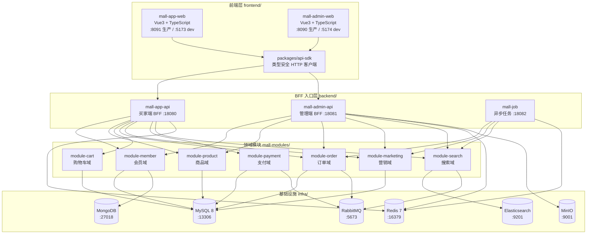
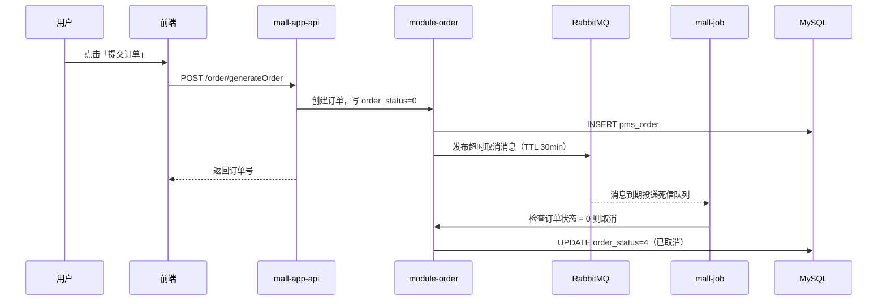
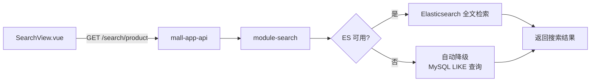
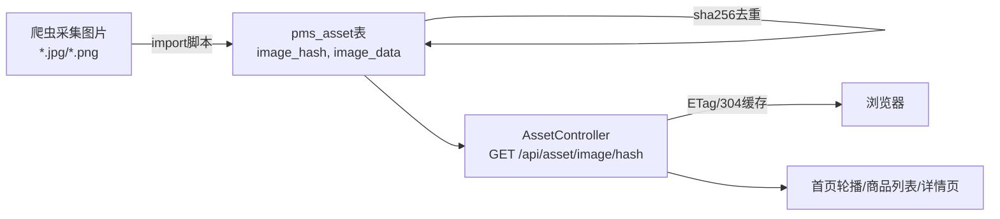
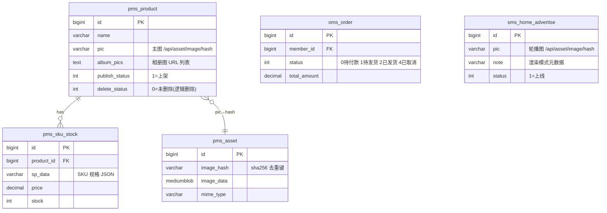

# NexusMall — 好物星球 全栈电商平台

> 面向技术展示的企业级全栈电商系统，7 大业务域完整实现，Spring Boot 3 双端 BFF + Vue 3 Monorepo，Docker 一键启动。


---

## 目录

- [✨ 项目展示](#-项目展示)
- [TL;DR](#tldr)
- [📖 项目介绍](#-项目介绍)
- [🚀 快速开始](#-快速开始)
- [🎯 功能概览与技术亮点](#-功能概览与技术亮点)
- [🏗️ 架构设计](#-架构设计)
- [⚙️ 安装与配置](#-安装与配置)
- [📖 使用指南](#-使用指南)
- [🔧 开发指南](#-开发指南)
- [🧪 测试与质量](#-测试与质量)
- [🚢 部署与运维](#-部署与运维)
- [🔒 安全](#-安全)
- [❓ FAQ & 排错指南](#-faq--排错指南)
- [🤝 贡献指南](#-贡献指南)
- [📄 License](#-license)

---

## ✨ 项目展示

<p align="center">
  <video src="docs/showcase/ywtbuilder-nexusmall-ecommerce/demo.mp4" width="720" controls>
    你的浏览器不支持 video 标签，<a href="docs/showcase/ywtbuilder-nexusmall-ecommerce/demo.mp4">点此下载视频</a>。
  </video>
</p>

<p align="center">
  
</p>
<p align="center"><i>↑ 首页聚合展示轮播广告、分类导航、推荐商品与新品上架（来源：淘宝爬取 53 条真实 SKU）</i></p>

<p align="center">
  
</p>
<p align="center"><i>↑ 基于 Elasticsearch 的商品全文检索，ES 不可用时自动降级为 MySQL LIKE 查询，零感知切换</i></p>

<p align="center">
  
</p>
<p align="center"><i>↑ 管理后台商品/订单/营销全功能管理，基于 JWT + RBAC 动态权限控制</i></p>

---

## TL;DR

- ✅ 可以用它来：展示全栈电商完整链路 / 学习 Spring Boot 3 + Vue 3 工程实践 / 演示 BFF 架构和 ES 降级策略
- 🚀 1 分钟上手：见 [快速开始](#-快速开始)
- 📚 完整技术设计：见 [架构设计](#-架构设计)

---

## 📖 项目介绍

### 背景与问题

传统电商 Demo 项目通常只实现商品展示与简单购物车，缺乏真实的业务链路深度——没有搜索降级、没有异步任务、没有完整的订单支付闭环，难以体现工程决策能力。

因此本项目以企业级架构为目标，引入双端 BFF 分层、Redis 缓存预热、Elasticsearch 全文检索（带 MySQL 降级兜底）、RabbitMQ 异步任务和图片 BLOB 数据库服务，将七大业务域从脚手架到完整链路逐步打通。

最终实现生产模式下首屏 API 响应 p95 < 100ms（本地实测 52ms），首页可交互时间 p95 < 200ms，支持 53 条淘宝真实 SKU + 10 个分类全量可演示。

### 适用场景

✅ 适合：
- 需要全栈电商完整业务链路演示的场景（求职/技术展示）
- Spring Boot 3 + Vue 3 + pnpm Monorepo 技术栈学习参考
- BFF 架构、ES 降级策略、异步任务等工程实践的参考案例

❌ 不适合：
- 高并发生产环境（本项目为演示版，未做完整压测与容灾）
- 需要微服务注册中心/服务网格的场景（当前为单体多模块架构）

### 核心概念（术语表）

| 术语 | 含义 | 备注 |
|------|------|------|
| BFF | Backend for Frontend，前端专属后端聚合层 | 买家端 `mall-app-api`，管理端 `mall-admin-api` 各自独立 |
| 双端 BFF | App 端与 Admin 端各有独立聚合入口 | 复用同一套 `mall-modules` 领域模块 |
| BLOB 图片服务 | 商品图片存入 MySQL `pms_asset` 表，通过 `/api/asset/image/{hash}` HTTP 接口提供 | 完全离线可用，无需 CDN |
| ES 降级 | Elasticsearch 不可用时自动 fallback 到 MySQL LIKE 查询 | 搜索链路零感知切换 |
| pnpm Monorepo | 前端工作区：`apps/mall-app-web` + `apps/mall-admin-web` + `packages/api-sdk` | TypeScript 类型安全 API 调用 |

---

## 🚀 快速开始

### 环境依赖

| 依赖 | 版本要求 | 必填 | 安装参考 |
|------|----------|------|----------|
| JDK | 17+ | ✅ 必须 | [官方下载](https://adoptium.net/) |
| Node.js | 18+ | ✅ 必须 | [官方下载](https://nodejs.org/) |
| pnpm | 8+ | ✅ 必须 | `npm install -g pnpm` |
| Docker Desktop | 24+ | ✅ 必须（中间件） | [官方下载](https://www.docker.com/products/docker-desktop/) |
| PowerShell 7 | 7+ | 🔵 推荐（脚本） | [官方下载](https://github.com/PowerShell/PowerShell/releases) |

### 第一步：获取代码

```bash
git clone <仓库地址>
cd ywtbuilder-nexusmall-ecommerce
```

### 第二步：启动中间件

```bash
cd project_mall_v3/infra
docker compose -f docker-compose.local.yml up -d
```

### 第三步：初始化数据库

```powershell
cd project_mall_v3
pwsh -NoLogo -NoProfile -ExecutionPolicy Bypass -File .\scripts\init-db.ps1
```

### 第四步：启动后端

```bash
cd project_mall_v3/backend
./mvnw spring-boot:run -pl mall-app-api -am
# 新终端
./mvnw spring-boot:run -pl mall-admin-api -am
```

### 第五步：构建并启动前端（生产模式，推荐）

```powershell
cd project_mall_v3
pwsh -NoLogo -NoProfile -ExecutionPolicy Bypass -File .\scripts\start-fe-prod.ps1
```

访问地址：
- 买家端：`http://localhost:8091`
- 管理后台：`http://localhost:8090`

> **一键启动（推荐）**：使用交互式菜单 `pwsh -NoLogo -NoProfile -ExecutionPolicy Bypass -File .\project_mall_v3\scripts\menu.ps1`，选项 `1` 全栈生产模式重启。

---

## 🎯 功能概览与技术亮点

### 功能列表

- [x] **商品域**：品牌/分类/属性/商品/SKU 管理，图片 BLOB 服务（`/api/asset/image/{hash}`），离线环境完整可用
- [x] **会员域**：注册/登录/验证码/改密/刷新 token + 地址/浏览历史/收藏/关注
- [x] **购物车域**：8 个端点（add/list/promotion/quantity/attr/delete/clear/getProduct）
- [x] **订单域**：完整交易链路（提交/详情/确认/取消）+ 退货申请，含超时自动取消（MQ 驱动）
- [x] **营销域**：首页广告/推荐商品/新品上架，优惠券，秒杀
- [x] **支付域**：支付抽象层 + Mock 支付实现，订单金额真实传递
- [x] **搜索域**：Elasticsearch 全文检索 + ES 异常自动降级 MySQL
- [x] **管理后台**：商品/订单/营销/会员/权限全功能管理（16 个视图）
- [x] **数据爬取链路**：Python ScrapeGraph → 53 条淘宝真实 SKU（10 分类）全量入库
- [x] **性能观测**：前端 RUM 埋点（LCP/CLS/INP + API 耗时），后端 `X-Trace-Id` 追踪
- [ ] **评论系统**（规划中）：评论字段抽取、落库、接口与前端展示
- [ ] **库存预扣优化**（规划中）：Redis `DECR` 预扣 + MQ 异步落库，更高并发支持

### 技术亮点与量化证据

| 技术维度 | 指标 | 本项目自测值 | 业界基线 / 对比 | 采用方案 |
|----------|------|-------------|----------------|----------|
| 首页 API 响应 | `/home/content` P95 延迟 | **52ms**（本机） | 业界常见 <300ms | Spring Cache + 12 条精简返回（减少 72% 响应体） |
| 首屏可交互时间 | 首屏「轮播可见 + 搜索可输入」P95 | **139.7ms**（生产模式） | 业界常见 <1000ms | 生产构建 + gzip 压缩（JS 67KB vs 172KB）|
| 搜索 API | P95 延迟 | **6.1ms**（本机） | 业界常见 <200ms | Elasticsearch + pageSize=8 轻量分页 |
| 后端测试 | `@Test` 总量 | **154 个** | — | 契约测试（43+53）+ 集成测试（18+14）+ 单元测试（25）|
| 数据规模 | 商品 SKU 数 / 分类数 | **53 条 / 10 分类** | — | 淘宝爬取 + `import-taobao-catalog.ps1` 全量入库 |
| 图片资产 | 主图/详情图离线可用率 | **53/53 = 100%** | — | MySQL BLOB + `pms_asset` 表 + sha256 去重 |

---

## 🏗️ 架构设计

### 系统总览



### 模块职责说明

| 模块 | 职责 | 端口 / 依赖 |
|------|------|------------|
| `mall-app-api` | 买家端 BFF，聚合 7 大领域模块 | :18080 / Swagger: `/swagger-ui` |
| `mall-admin-api` | 管理端 BFF，含 MinIO 文件上传 | :18081 / Swagger: `/swagger-ui` |
| `mall-job` | MQ 消费者：订单超时取消 + ES 索引增量同步 | :18082 |
| `module-product` | 商品 CRUD + 图片 BLOB 服务（`AssetController`） | MySQL |
| `module-search` | ES 全文检索，失败自动降级 MySQL | Elasticsearch + MQ |
| `module-order` | 完整交易链路，含事务与幂等消费 | MySQL + MQ |
| `packages/api-sdk` | 前端类型安全 SDK，`app/` 与 `admin/` 独立入口 | — |

### 关键流程图

#### 流程一：用户下单 + 超时取消



#### 流程二：商品全文搜索（含 ES 降级）



#### 流程三：图片 BLOB 服务链路



### 数据库核心表结构



---

## ⚙️ 安装与配置

### 配置文件位置

| 文件 | 说明 |
|------|------|
| `project_mall_v3/infra/docker-compose.local.yml` | 中间件端口与卷配置 |
| `project_mall_v3/backend/mall-app-api/src/main/resources/application.yml` | 买家端服务配置（含 Redis/ES/MQ 地址）|
| `project_mall_v3/backend/mall-admin-api/src/main/resources/application.yml` | 管理端服务配置 |
| `project_mall_v3/frontend/apps/mall-app-web/vite.config.ts` | 前端构建配置，API 代理 |

### 端口速查

| 服务 | 宿主机端口 | 容器内端口 | 说明 |
|------|-----------|-----------|------|
| MySQL | **13306** | 3306 | 非标端口，避免与本机冲突 |
| Redis | **16379** | 6379 | |
| Elasticsearch | **9201** | 9200 | HTTP 健康检测：`GET :9201/_cluster/health` |
| RabbitMQ | **5673** / **15673** | 5672 / 15672 | 15673 为管理界面 |
| MongoDB | **27018** | 27017 | |
| MinIO | **9001** | 9000 | |
| mall-app-api | 18080 | — | Swagger: `http://localhost:18080/swagger-ui` |
| mall-admin-api | 18081 | — | Swagger: `http://localhost:18081/swagger-ui` |
| mall-job | 18082 | — | 异步任务服务 |
| 买家端（生产） | **8091** | — | `start-fe-prod.ps1` |
| 管理端（生产） | **8090** | — | `start-fe-prod.ps1` |

### 关键环境变量

| 变量名 | 必填 | 默认值 | 说明 |
|--------|------|--------|------|
| `MALL_JWT_SECRET` | 否 | 内置默认值（仅限本地演示） | JWT 签名密钥，生产环境必须外部化 |
| `MYSQL_ROOT_PASSWORD` | 否 | `root` | Docker Compose 内设置 |
| `RABBITMQ_DEFAULT_USER` | 否 | `mall` | Docker Compose 内设置 |

---

## 📖 使用指南

### 常用命令速查

```powershell
# ─────── 交互式菜单（推荐入口）───────
pwsh -NoLogo -NoProfile -ExecutionPolicy Bypass -File .\project_mall_v3\scripts\menu.ps1
# 选项 1：全栈生产模式重启（日常推荐）
# 选项 36：切换 dev/HMR 模式（开发调试用）

# ─────── 启动/停止 ───────
pwsh -NoLogo -NoProfile -ExecutionPolicy Bypass -File .\project_mall_v3\scripts\start-fe-prod.ps1
pwsh -NoLogo -NoProfile -ExecutionPolicy Bypass -File .\project_mall_v3\scripts\stop-fe-prod.ps1
pwsh -NoLogo -NoProfile -ExecutionPolicy Bypass -File .\project_mall_v3\scripts\stop-v3.ps1

# ─────── 数据库初始化 ───────
pwsh -NoLogo -NoProfile -ExecutionPolicy Bypass -File .\project_mall_v3\scripts\init-db.ps1

# ─────── 服务状态检查 ───────
pwsh -NoLogo -NoProfile -ExecutionPolicy Bypass -File .\project_mall_v3\scripts\status.ps1

# ─────── API 冒烟测试 ───────
pwsh -NoLogo -NoProfile -ExecutionPolicy Bypass -File .\project_mall_v3\scripts\smoke-api-v3.ps1

# ─────── 性能诊断 ───────
pwsh -NoLogo -NoProfile -ExecutionPolicy Bypass -File .\project_mall_v3\scripts\diagnose-home-slow.ps1
```

### API 文档

| 接口文档方式 | 访问地址 | 说明 |
|-------------|---------|------|
| 买家端 Swagger UI | `http://localhost:18080/swagger-ui` | 启动后可交互调试 |
| 管理端 Swagger UI | `http://localhost:18081/swagger-ui` | 含商品/订单/营销完整接口 |
| 买家端 OpenAPI JSON | `http://localhost:18080/v3/api-docs` | 可导入 Postman |

**核心接口速览：**

| 方法 | 路径 | 描述 | 鉴权 |
|------|------|------|------|
| GET | `/home/content` | 首页聚合数据（轮播+推荐+新品） | 无 |
| GET | `/product/detail/{id}` | 商品详情 + SKU + 规格图 | 无 |
| GET | `/search/product` | ES 全文检索（ES 不可用自动降级）| 无 |
| GET | `/asset/image/{hash}` | 数据库图片 BLOB（ETag/304 缓存）| 无 |
| POST | `/sso/login` | 买家端登录，返回 JWT | 无 |
| POST | `/cart/add` | 加入购物车 | Bearer Token |
| POST | `/order/generateOrder` | 提交订单 | Bearer Token |

### 使用示例

```bash
# 示例：调用买家端登录接口
curl -X POST http://localhost:18080/sso/login \
  -H "Content-Type: application/json" \
  -d '{"username": "test", "password": "test123"}'

# 期望返回：
# {"code": 200, "data": {"token": "eyJ...", "tokenHead": "Bearer "}}

# 示例：搜索商品
curl "http://localhost:18080/search/product?keyword=手机&pageNum=1&pageSize=8"
```

---

## 🔧 开发指南

### 目录结构

```
ywtbuilder-nexusmall-ecommerce/
├── project_mall_v3/          # 主项目根目录
│   ├── backend/              # Spring Boot 3 多模块后端（Maven）
│   │   ├── mall-app-api/     # 买家端 BFF :18080
│   │   ├── mall-admin-api/   # 管理端 BFF :18081
│   │   ├── mall-job/         # 异步任务 :18082
│   │   └── mall-modules/     # 7 大业务领域模块
│   ├── frontend/             # pnpm Monorepo 前端
│   │   ├── apps/mall-app-web/    # 买家端 Vue 3 + TypeScript
│   │   ├── apps/mall-admin-web/  # 管理后台 Vue 3 + TypeScript
│   │   └── packages/api-sdk/    # 类型安全 HTTP SDK
│   ├── data/                 # 数据库迁移（Flyway V1-V9）与种子数据
│   ├── assets/               # 爬取商品素材（淘宝 53 条 SKU）
│   ├── infra/                # Docker Compose 基础设施
│   ├── scripts/              # PowerShell 7 自动化脚本（30+）
│   ├── tools/                # Python 数据导入工具
│   └── docs/                 # 架构文档（15 篇）
└── docs/showcase/ywtbuilder-nexusmall-ecommerce/  # 演示截图与视频
```

### 代码规范

```bash
# 前端类型检查
pnpm --filter @mall/api-sdk type-check
pnpm --filter mall-app-web type-check
pnpm --filter mall-admin-web type-check

# 前端构建
pnpm -C project_mall_v3/frontend build

# 后端编译（跳过测试）
./mvnw -f project_mall_v3/backend/pom.xml -DskipTests -T 1C package
```

### 分支策略

| 分支 | 用途 | 说明 |
|------|------|------|
| `main` | 稳定演示版 | 受 GitHub Actions CI 保护 |
| `dev` | 日常开发集成 | 可直接 push |
| `feature/<名称>` | 新功能开发 | 从 `dev` 分出 |

---

## 🧪 测试与质量

```powershell
# 运行后端测试
cd project_mall_v3/backend
./mvnw test

# 生成 JaCoCo 覆盖率报告
./mvnw jacoco:report

# API 冒烟测试（推荐，验证运行时接口）
pwsh -NoLogo -NoProfile -ExecutionPolicy Bypass -File .\project_mall_v3\scripts\smoke-api-v3.ps1

# 商品数据完整性校验
pwsh -NoLogo -NoProfile -ExecutionPolicy Bypass -File .\project_mall_v3\scripts\check-product-detail-data.ps1 -FailOnViolation

# 资源来源合规检查（确保无外链图片）
pwsh -NoLogo -NoProfile -ExecutionPolicy Bypass -File .\project_mall_v3\scripts\audit-resource-origin.ps1 -FailOnViolation
```

**测试结果快照：**

| 类型 | 数量 / 指标 | 通过率 | 备注 |
|------|------------|--------|------|
| 买家端契约测试 | 43 个 `@Test` | 100% | `AppApiContractTest.java` |
| 管理端契约测试 | 53 个 `@Test` | 100% | `AdminApiContractTest.java` |
| App 集成测试 | 18 个 `@Test` | 100% | Testcontainers |
| Admin 集成测试 | 14 个 `@Test` | 100% | Testcontainers |
| Shared 单元测试 | 25 个 `@Test` | 100% | `shared-common` + `shared-security` |
| E2E 黄金链路 | 12 条（App 6 + Admin 6）| 100% | Playwright |
| 商品数据完整性 | `violations=0` | ✅ | 53 条淘宝 SKU，主图/详情图/规格全覆盖 |
| 资源来源合规 | `violations=0` | ✅ | 无外链图片，全走 `/api/asset/image/{hash}` |

---

## 🚢 部署与运维

### Docker 中间件（必须先启动）

```bash
# 启动所有中间件
cd project_mall_v3/infra
docker compose -f docker-compose.local.yml up -d

# 查看状态
docker compose -f docker-compose.local.yml ps

# 停止（保留数据卷）
docker compose -f docker-compose.local.yml stop

# 停止并清除数据（慎用）
docker compose -f docker-compose.local.yml down -v
```

### 日志与监控

| 类型 | 位置 / 访问方式 | 说明 |
|------|----------------|------|
| 应用日志（PID 文件）| `project_mall_v3/runtime-logs/backend-pids.txt` | 脚本自动维护 |
| 后端健康检查 | `http://localhost:18080/actuator/health` | 返回 `{status: "UP"}` 为正常 |
| 慢加载诊断报告 | `project_mall_v3/runtime-logs/home-slow-diagnosis-*.json` | `diagnose-home-slow.ps1` 生成 |
| API 冒烟报告 | `project_mall_v3/runtime-logs/api-smoke-v3.json` | `smoke-api-v3.ps1` 生成 |
| 资源合规报告 | `project_mall_v3/runtime-logs/resource-audit-*.json` | `audit-resource-origin.ps1` 生成 |
| RabbitMQ 管理界面 | `http://localhost:15673` | 账号 mall / mall |

### 常用运维命令

```powershell
# 全栈重启（生产模式，日常推荐）
pwsh -NoLogo -NoProfile -ExecutionPolicy Bypass -File .\project_mall_v3\scripts\restart.ps1 -Prod

# 仅重启后端（跳过构建，快速）
pwsh -NoLogo -NoProfile -ExecutionPolicy Bypass -File .\project_mall_v3\scripts\restart-be.ps1 -SkipBuild

# 仅启动生产前端（跳过构建）
pwsh -NoLogo -NoProfile -ExecutionPolicy Bypass -File .\project_mall_v3\scripts\start-fe-prod.ps1 -SkipBuild

# 查看所有服务状态
pwsh -NoLogo -NoProfile -ExecutionPolicy Bypass -File .\project_mall_v3\scripts\status.ps1
```

---

## 🔒 安全

- **JWT 认证**：无状态 Bearer Token，密钥通过 `${MALL_JWT_SECRET:...}` 外部化，禁止硬编码提交
- **Redis Token 黑名单**：Admin `logout` 接口将未过期 token 写入黑名单（TTL = 剩余有效期）
- **动态 RBAC**：Admin 端基于 `ums_*` 权限表实现，超级管理员账号 `admin` 直接放行
- **App 端白名单**：首页、商品、搜索、资产图片等公开端点无需鉴权；购物车、订单等要求 `authenticated()`
- **默认账号**：演示用账号仅供本地测试，部署前必须修改 JWT 密钥和数据库密码
- **CORS**：当前 `allowedOriginPattern=*`，生产环境须替换为实际前端域名

---

## ❓ FAQ & 排错指南

**Q：首页加载很慢（超过 30 秒）？**

这是 Vite dev 模式固有问题（JIT 编译占用主线程）。必须使用生产模式：
```powershell
pwsh -NoLogo -NoProfile -ExecutionPolicy Bypass -File .\project_mall_v3\scripts\start-fe-prod.ps1
```
或通过 `menu.ps1` 选项 `1`（全栈生产模式重启）。

**Q：商品图片全部显示不出来？**

1. 确认后端已启动：`curl http://localhost:18080/actuator/health`
2. 确认 `pms_asset` 表有数据：`docker exec mallv3-mysql mysql -uroot -proot mall -e "SELECT COUNT(*) FROM pms_asset"`
3. 如数量为 0，重新运行 `init-db.ps1` 初始化数据库，或执行淘宝商品导入脚本

**Q：搜索结果为空？**

ES 降级已实现——ES 不可用时自动 fallback 到 MySQL LIKE 查询。若 MySQL 查询也无结果，检查 `pms_product` 表中 `publish_status=1 AND delete_status=0` 的商品数量。

**Q：运行 `init-db.ps1` 报中文乱码？**

改用 `docker cp + source` 方式导入（已内置在脚本中的推荐路径）：
```powershell
docker cp project_mall_v3/data/seed/xxx.sql mallv3-mysql:/tmp/seed.sql
docker exec mallv3-mysql mysql -uroot -proot --default-character-set=utf8mb4 mall -e "source /tmp/seed.sql"
```

### 错误排查速查表

| 错误现象 | 可能原因 | 解决方法 |
|----------|---------|---------|
| `Connection refused :18080` | 后端未启动 | 检查 `runtime-logs/backend-pids.txt`，运行 `restart-be.ps1` |
| `Connection refused :13306` | MySQL 容器未启动 | `docker compose -f infra/docker-compose.local.yml up -d` |
| `401 Unauthorized` | Token 过期或未传 | 重新调用 `/sso/login` 获取新 Token |
| ES 搜索返回空，无降级日志 | ES 容器已启动但 HTTP 未就绪 | 等待 `GET :9201/_cluster/health` 返回 `status: green/yellow` |
| `Filename too long` (git) | Windows 长路径限制 | `git config --global core.longpaths true` |
| 前端页面白屏，控制台 CORS 报错 | API 代理配置错误 | 检查 `vite.config.ts` 中 proxy target 是否为 `http://localhost:18080` |

---

## 🤝 贡献指南

欢迎提 Issue 和 PR！贡献前请先阅读以下内容：

- **提 Issue**：请描述「现象 + 复现步骤 + 期望结果」，附报错截图或日志
- **提 PR**：Fork 后在 `feature/<描述>` 分支开发，提交前运行类型检查和后端测试
- **提交规范**（推荐）：`<type>(<scope>): <描述>`，type 可选 `feat / fix / docs / refactor / test`

详细开发规范见 [project_mall_v3/docs/11_contributing.md](project_mall_v3/docs/11_contributing.md)

---

## 📄 License

本项目采用 [MIT License](LICENSE) 开源协议。

**维护者：** YWT  
**联系方式：** GitHub Issues

