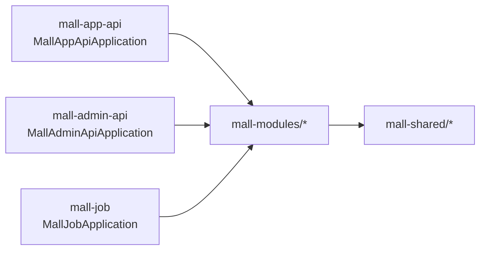

# Backend 模块总览（Mall V3）

> 文档导航：统一入口见 [../docs/README.md](../docs/README.md)。

## 1. 文档目标

本文件是 `project_mall_v3/backend` 的“事实版说明”，用于回答 4 个问题：

1. 当前后端到底由哪些模块组成。
2. 每个运行单元（app/admin/job）真实依赖了哪些组件与中间件。
3. 关键接口与关键数据流现在是怎么跑的。
4. 改动时应该落在哪些文件，避免改偏位置。

## 2. 当前真实状态（核对时间：2026-02-25）

1. `backend` 是 Maven 聚合工程，共 **14 个模块**：`4 个 shared + 7 个 domain + 3 个运行单元`。
2. 运行单元端口：`mall-app-api=18080`、`mall-admin-api=18081`、`mall-job=18082`。
3. App 控制器数量 **16**，Admin 控制器数量 **28**，Job 消费者数量 **2**。
4. `SearchController` 已实现 **ES 查询失败/空结果/脏数据自动回退 MySQL**。
5. `mall-job` 已定义 RabbitMQ 队列拓扑并消费消息；当前代码中未检索到 `RabbitTemplate.convertAndSend(...)` 生产端实现。

## 3. 文件结构图（任务相关子树）

```text
backend/
├─ pom.xml                               # Maven 聚合根（mall-v3）
├─ mvnw / mvnw.cmd
├─ mall-shared/
│  ├─ shared-common/                     # 通用返回、异常、验证码、Redis 服务
│  ├─ shared-security/                   # JWT、黑名单、动态权限
│  ├─ shared-web/                        # 全局异常、OpenAPI 基类
│  └─ shared-test/                       # TestContainers 测试基类
├─ mall-modules/
│  ├─ module-member/                     # 会员 + Mongo 行为数据
│  ├─ module-product/                    # 商品/SPU/SKU/品牌/分类/属性
│  ├─ module-cart/                       # 购物车
│  ├─ module-order/                      # 订单与售后
│  ├─ module-marketing/                  # 优惠券/秒杀/首页运营位
│  ├─ module-payment/                    # 支付抽象（当前 mock 实现）
│  └─ module-search/                     # ES 检索
├─ mall-app-api/                         # C 端 BFF
├─ mall-admin-api/                       # 管理端 BFF
├─ mall-job/                             # 异步消费与定时任务
└─ README.md
```

## 4. 依赖关系图（入口文件/类名）



边界规则（按当前代码）：

1. `mall-app-api` / `mall-admin-api` 主要承担 Controller 聚合、鉴权接入、参数编排。
2. 业务实现下沉在 `mall-modules/*/service/impl/*ServiceImpl.java`。
3. `mall-shared/*` 提供可复用基础能力，不直接承载业务流程。
4. 异步队列定义统一在 `mall-job/src/main/java/com/mall/job/config/RabbitMqConfig.java`。

## 5. 构建与技术栈（基于 `backend/pom.xml`）

| 维度 | 当前实现 |
|---|---|
| Java 版本 | 17 |
| 构建方式 | Maven 多模块聚合（`backend/pom.xml`） |
| Parent | `spring-boot-starter-parent:3.3.5` |
| ORM | MyBatis-Plus `3.5.8` |
| API 文档 | Springdoc OpenAPI `2.6.0` |
| 鉴权 | JJWT `0.12.6` |
| 对象存储 | MinIO `8.5.7` |
| 数据迁移 | Flyway `10.10.0` |
| 测试基础设施 | Testcontainers `1.20.4` |

## 6. 运行单元与配置快照

### 6.1 启动类与扫描范围

| 服务 | 启动类 | 关键扫描特征 |
|---|---|---|
| App BFF | `com.mall.app.MallAppApiApplication` | `@MapperScan(com.mall.module.*.mapper)` + `@EnableElasticsearchRepositories` + `@EnableMongoRepositories` |
| Admin BFF | `com.mall.admin.MallAdminApiApplication` | App 扫描基础上额外扫描 `com.mall.admin.mapper` |
| Job | `com.mall.job.MallJobApplication` | `@EnableScheduling` + `@EnableElasticsearchRepositories`，不启用 Mongo Repository |

### 6.2 外部依赖矩阵（来自各自 `application.yml`）

| 依赖 | mall-app-api | mall-admin-api | mall-job |
|---|---|---|---|
| MySQL | `jdbc:mysql://localhost:13306/mall` | 同 app | 同 app |
| Redis | `localhost:16379/0` | `localhost:16379/1` | `localhost:16379/2` |
| MongoDB | `mongodb://localhost:27018/mall` | 同 app | 未配置 |
| Elasticsearch | `http://localhost:9201` | 同 app | 同 app |
| RabbitMQ | `localhost:5673`，`mall/mall`，`/mall` | 同 app | 同 app |
| MinIO | 未配置 | `http://localhost:19090` | 未配置 |
| Flyway | `enabled: false` | `enabled: false` | 未配置 |

### 6.3 管理端口

1. `mall-app-api`：`18080`
2. `mall-admin-api`：`18081`
3. `mall-job`：`18082`

## 7. 接口与职责清单（按真实 Controller）

### 7.1 App BFF（`mall-app-api`，16 个 Controller）

| 分组 | Controller | 典型路由前缀 |
|---|---|---|
| 登录与用户 | `SsoController`, `UserCenterController` | `/sso`, `/user/center` |
| 首页与商品 | `HomeController`, `ProductController`, `PortalBrandController`, `SearchController` | `/home`, `/product`, `/brand`, `/search` |
| 交易链路 | `CartController`, `OrderController`, `PaymentController`, `ReturnApplyController` | `/cart`, `/order`, `/payment`, `/returnApply` |
| 资源服务 | `AssetController` | `/asset/*` |
| 会员资产 | `MemberAddressController`, `MemberAttentionController`, `MemberCouponController`, `MemberProductCollectionController`, `MemberReadHistoryController` | `/member/*` |

### 7.2 Admin BFF（`mall-admin-api`，28 个 Controller）

| 分组 | Controller（示例） | 典型路由前缀 |
|---|---|---|
| 权限与账号 | `UmsAdminController`, `UmsRoleController`, `UmsMenuController`, `UmsResourceController` | `/admin`, `/role`, `/menu`, `/resource` |
| 商品中心 | `PmsProductController`, `PmsBrandController`, `PmsSkuStockController`, `PmsProductCategoryController` | `/product`, `/brand`, `/sku`, `/productCategory` |
| 订单中心 | `OmsOrderController`, `OmsOrderReturnApplyController`, `OmsOrderSettingController` | `/order`, `/returnApply`, `/orderSetting` |
| 营销中心 | `SmsCouponController`, `SmsFlashPromotionController`, `SmsHomeAdvertiseController` 等 | `/coupon`, `/flash`, `/home/*` |
| 搜索与文件 | `EsProductController`, `MinioUploadController` | `/esProduct`, `/minio` |

### 7.3 Job（`mall-job`）

| 组件 | 作用 | 绑定队列 |
|---|---|---|
| `OrderCancelConsumer` | 订单超时取消消费 | `mall.order.cancel` |
| `EsProductSyncConsumer` | 商品 ES 同步消费 | `mall.product.es.sync` |
| `RabbitMqConfig` | 定义交换机/队列/绑定 | `mall.order.direct`、`mall.product.topic` |

## 8. 数据流/接口清单（当前实现）

### 8.1 搜索链路（ES 失败自动降级）

- API：`GET /search/product`（兼容 `/search/esProduct/search`）
- 入口：`mall-app-api/.../SearchController#search`
- 逻辑：
1. 先调 `EsProductService.search(...)`。
2. 若 ES 异常、空结果或命中未上架数据，回退 `ProductService.list(...)`（MySQL）。
3. 回退查询显式约束 `publishStatus=1`，并在商品服务中叠加 `deleteStatus=0`。

### 8.2 订单超时取消链路

- 队列定义：`RabbitMqConfig`
  - `mall.order.ttl`（延迟队列）
  - `mall.order.cancel`（死信消费队列）
- 消费入口：`OrderCancelConsumer#handle(Long orderId)` -> `PortalOrderService.cancelOrder(orderId)`
- 现状：消费者与拓扑已具备，当前代码未检索到生产端 `RabbitTemplate.convertAndSend`。

### 8.3 ES 商品同步链路

- 管理端入口：`POST /esProduct/importAll`、`POST /esProduct/create/{id}`（Admin）
- Job 消费入口：`EsProductSyncConsumer#handle(Long productId)` -> `EsProductService.create(productId)`
- 队列路由：`mall.product.topic` + `product.#` -> `mall.product.es.sync`

### 8.4 用户中心聚合链路

- API：`GET /user/center/summary`
- 入口：`UserCenterController#summary`
- 聚合来源：`MemberService` + `CouponService` + 关注/收藏/浏览记录服务 + `CartService`
- 用途：减少“我的”页首屏多请求抖动。

## 9. 资源全景图（数据源 -> 模块 -> 存储 -> 页面/API）

| 数据维度 | 主要模块 | 存储 | 主要接口入口 |
|---|---|---|---|
| 商品/SPU/SKU | `module-product` | MySQL（`pms_*`） | App `/product/*`，Admin `/product/*` |
| 订单/售后 | `module-order` | MySQL（`oms_*`） | App `/order/*`、`/returnApply/*`，Admin `/order*` |
| 支付日志 | `module-payment` | MySQL（`oms_payment_log`） | App `/payment/*` |
| 营销运营位 | `module-marketing` | MySQL（`sms_*`） | App `/home/*`，Admin `/home/*`、`/coupon/*`、`/flash*` |
| 会员基础信息 | `module-member` | MySQL（`ums_member*`） | App `/sso/*`、`/member/*` |
| 会员行为（关注/收藏/浏览） | `module-member` | MongoDB（`member_brand_attention`、`member_product_collection`、`member_read_history`） | App `/member/attention/*`、`/member/productCollection/*`、`/member/readHistory/*` |
| 搜索索引 | `module-search` | Elasticsearch（index: `pms`） | App `/search/*`，Admin `/esProduct/*` |

## 10. 常见改动落点

| 任务 | 主要改动位置 |
|---|---|
| 新增 C 端接口 | `mall-app-api/src/main/java/com/mall/app/controller/` + 对应 `module-*/service/` |
| 新增管理端接口 | `mall-admin-api/src/main/java/com/mall/admin/controller/` + 对应 `module-*/service/` |
| 改登录/JWT/权限 | `mall-shared/shared-security/src/main/java/com/mall/security/` + app/admin `config/SecurityConfig.java` |
| 改全局异常/返回结构 | `mall-shared/shared-common/src/main/java/com/mall/common/` + `mall-shared/shared-web/src/main/java/com/mall/web/` |
| 改队列消费拓扑 | `mall-job/src/main/java/com/mall/job/config/` + `mall-job/src/main/java/com/mall/job/consumer/` |
| 改数据库结构 | `../data/migration/*.sql` + 对应 `module-*` 的 `entity/mapper/service` |

## 11. 常用命令（PowerShell）

```powershell
cd d:/Desktop/work/mall/project_mall_v3/backend
.\mvnw.cmd -q -DskipTests compile
.\mvnw.cmd test
.\mvnw.cmd package -DskipTests
.\mvnw.cmd -pl mall-app-api -am spring-boot:run
.\mvnw.cmd -pl mall-admin-api -am spring-boot:run
.\mvnw.cmd -pl mall-job -am spring-boot:run
```

## 12. 本次核对记录（2026-02-25）

1. 已核对：`backend/pom.xml`、三套 `application.yml`、app/admin/job 启动类、controller 清单、job 队列配置与消费者。
2. 已验证：`.\mvnw.cmd -q -DskipTests compile` 通过。
3. 已修正：文档中的类路径和职责描述全部改为当前代码真实路径（例如 `JwtAuthFilter` 位于 `security/filter`，测试基类为 `com.mall.test.AbstractIntegrationTest`）。
