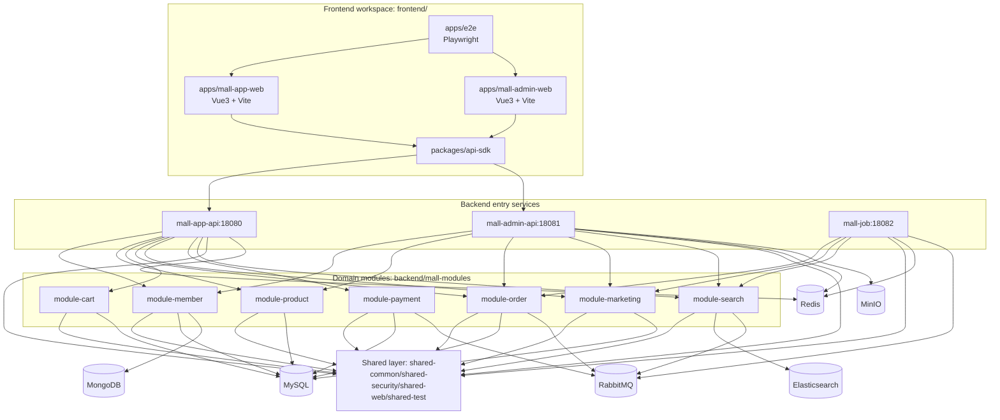

# 00 - V3 架构蓝图

> 文档导航：返回 [docs/README.md](README.md)。

## 0. 本次校对说明（2026-02-25）

1. 已按 `backend/**/pom.xml`、`application.yml`、`controller`、`mall-job` 消费者代码逐项核对。
2. 与 2026-02-23 版本相比，`mall-app-api` 新增 `UserCenterController`（`GET /user/center/summary`）与 `AssetController`（`GET /asset/image/{hash}`）。
3. 当前仅确认 `mall-job` 消费侧与队列拓扑稳定；生产侧消息投递仍需按业务链路补充验证。

## 1. 架构总览（当前仓库事实）



## 2. 目录与聚合根位置

| 层级 | 实际位置 | 说明 |
|---|---|---|
| 后端 Maven 聚合根 | `backend/pom.xml` | 仓库根目录不存在 `pom.xml` |
| 前端 workspace | `frontend/pnpm-workspace.yaml` | 当前仅 `apps/*` 与 `packages/*` |
| 基础设施编排 | `infra/docker-compose.local.yml` | 本地中间件统一入口 |

## 3. Maven 模块与直接依赖（按 `backend/**/pom.xml`）

```text
mall-v3 (backend/pom.xml, packaging=pom)
├── mall-shared
│   ├── shared-common
│   ├── shared-security  -> shared-common + Spring Security + JJWT
│   ├── shared-web       -> shared-common + Spring Web + Springdoc
│   └── shared-test      -> shared-common + shared-security + Testcontainers
├── mall-modules
│   ├── module-member    -> shared-common + shared-security + MongoDB + MyBatis-Plus
│   ├── module-product   -> shared-common + MyBatis-Plus
│   ├── module-cart      -> shared-common + MyBatis-Plus
│   ├── module-order     -> shared-common + MyBatis-Plus + AMQP
│   ├── module-marketing -> shared-common + MyBatis-Plus
│   ├── module-payment   -> shared-common + MyBatis-Plus + AMQP
│   └── module-search    -> shared-common + Elasticsearch + AMQP
├── mall-app-api         -> shared-common/security/web + member/product/cart/order/marketing/payment/search
├── mall-admin-api       -> shared-common/security/web + member/product/order/marketing/search
└── mall-job             -> shared-common + order/marketing/search
```

> 当前后端模块中不存在 `mall-openapi`；OpenAPI 由 `mall-app-api` 与 `mall-admin-api` 各自通过 springdoc 暴露。

## 4. 前端工作区现状（按 `frontend/`）

| 类型 | 实际模块 |
|---|---|
| apps | `mall-app-web`, `mall-admin-web`, `e2e` |
| packages | `api-sdk` |

> 文档中不再保留未落地的 `ui-kit`、`shared-utils` 条目。

## 5. 基础设施与默认端口（按 `application.yml` 与 compose）

| 组件 | 端口 | 主要用途 |
|---|---|---|
| App API | `18080` | C 端 BFF |
| Admin API | `18081` | 管理端 BFF |
| Job | `18082` | MQ 消费/异步任务 |
| MySQL | `13306` | 主业务数据 |
| Redis | `16379` | 缓存、验证码、黑名单 |
| MongoDB | `27018` | 会员行为数据 |
| RabbitMQ | `5673` / `15673` | 异步消息 |
| Elasticsearch | `9201` / `9301` | 商品搜索 |
| MinIO | `19090` / `19001` | 对象存储 |

## 6. 安全架构（当前实现）

1. JWT 认证在 `shared-security` 统一实现（`JwtService` + `JwtAuthFilter`）。
2. token 黑名单由 Redis 维护（`TokenBlacklistService`）。
3. Admin 动态资源鉴权由 `DynamicResourcePermissionService` + `ums_resource` 规则驱动。
4. 验证码流程由 `AuthCodeService` 提供，接口入口为 `GET /sso/getAuthCode`。
5. 当前 Admin 动态权限策略存在 fail-open 口径（资源表为空或路径未匹配时放行），生产建议改为 fail-close。

## 7. 工程边界（研发红线）

1. Controller 只做参数接收与路由，核心业务逻辑放 Service。
2. PO/Entity 不直接返回前端，统一通过 DTO/VO。
3. 模块间禁止跨模块直接查表，跨域能力通过服务接口组合。
4. 前端统一通过 `frontend/packages/api-sdk` 发起后端请求。
5. 数据结构变更必须通过 `data/migration/V{next}__*.sql` 演进。
