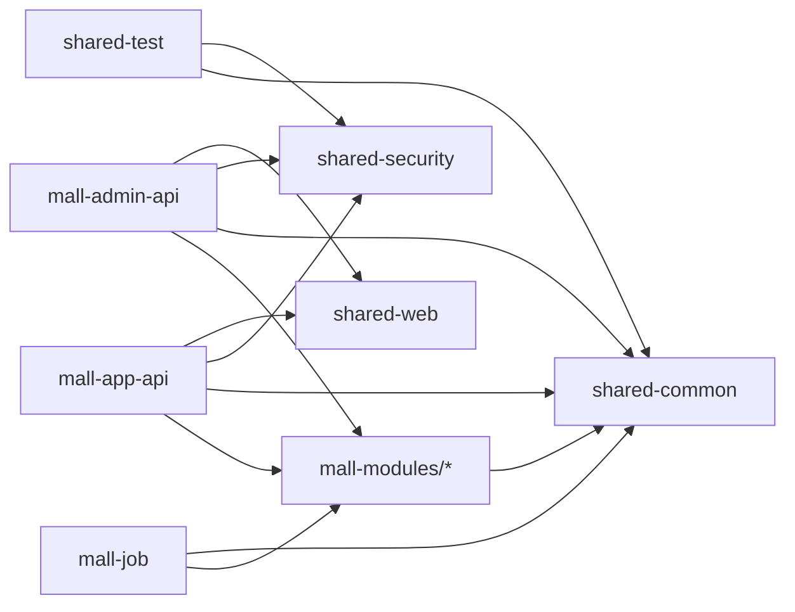

---
owner: architecture
updated: 2026-02-26
scope: mall-v3
audience: dev,qa,ops
doc_type: analysis
---

# 07 — 模块全景盘点与文档现状

> 文档导航：返回 [docs/README.md](README.md)。

## 1. 背景与目标

本文件用于回答三个问题：

1. `project_mall_v3` 各模块当前负责什么。
2. 现有文档是否覆盖核心模块与关键边界。
3. 仍需补齐的文档缺口有哪些。

## 2. 顶层模块盘点（当前状态）

| 模块 | 当前职责 | 关键入口 | 现有文档情况 | 结论 |
|---|---|---|---|---|
| `.github/` | CI 流水线 | `.github/workflows/ci.yml` | 已有 `.github/README.md` | 继续维护 |
| `backend/` | Java 多模块后端（shared/domain/bff/job） | `backend/pom.xml` | 已有 `backend/README.md`、`backend/mall-modules/README.md` | 继续维护 |
| `data/` | 迁移与种子 SQL | `data/migration/*`, `data/seed/*` | 已有 `data/README.md` | 继续维护 |
| `docs/` | 跨模块治理文档 | `docs/README.md` | 已有 `00-14` + `README.md` | 按编号体系持续维护 |
| `frontend/` | 前端 monorepo（app/admin/sdk/e2e） | `frontend/package.json` | 已有 `frontend/README.md` | 继续维护 |
| `infra/` | 本地中间件编排 | `infra/docker-compose.local.yml` | 已有 `infra/README.md` | 继续维护 |
| `runtime-logs/` | 本地运行日志与产物 | `runtime-logs/*.log` | 已有 `runtime-logs/README.md` | 仅作诊断信息源 |
| `scripts/` | 启停/预检/初始化/测试/文档校验脚本 | `scripts/*.ps1` | 已有 `scripts/README.md` | 继续维护 |
| `tests/` | 跨模块黑盒/灰盒 Java 测试 | `tests/README.md` | 已有文档 | 继续维护 |
| `tools/` | 抓取产物导入 mall_v3 的工具链 | `tools/README.md` | 已有文档 | 继续维护 |

## 3. Backend 深度分析

### 3.1 模块依赖结构



### 3.2 Backend 子模块一览（按 `src/main/java` 统计）

| 子模块 | Java 文件数 | 定位 | 关键类 |
|---|---:|---|---|
| `mall-shared/shared-common` | 9 | 通用响应、异常、验证码、Redis 访问 | `CommonResult`, `CommonPage`, `AuthCodeService`, `RedisService` |
| `mall-shared/shared-security` | 7 | JWT、黑名单、动态鉴权组件 | `JwtService`, `JwtAuthFilter`, `DynamicResourcePermissionService` |
| `mall-shared/shared-web` | 6 | 全局 Web 配置 | `GlobalExceptionHandler`, `CorsConfig`, `BaseSwaggerConfig` |
| `mall-shared/shared-test` | 2 | 共享测试基类 | `AbstractIntegrationTest`, `AbstractMvcIntegrationTest` |
| `mall-modules/module-member` | 23 | 会员、地址、收藏/关注/浏览记录（MySQL + MongoDB） | `MemberServiceImpl`, `MemberReadHistoryServiceImpl` |
| `mall-modules/module-product` | 40 | 商品/品牌/分类/SKU 领域 | `ProductServiceImpl`, `BrandServiceImpl` |
| `mall-modules/module-cart` | 4 | 购物车领域 | `CartServiceImpl` |
| `mall-modules/module-order` | 25 | 订单主流程 + 售后 + 订单设置 | `PortalOrderServiceImpl`, `AdminOrderServiceImpl` |
| `mall-modules/module-marketing` | 30 | 营销中心（优惠券/秒杀/首页配置） | `CouponServiceImpl`, `HomeAdvertiseServiceImpl` |
| `mall-modules/module-payment` | 4 | 支付抽象与日志（当前为 Mock） | `MockPaymentServiceImpl` |
| `mall-modules/module-search` | 4 | ES 检索读写能力 | `EsProductServiceImpl` |
| `mall-app-api` | 17 | 面向 C 端 BFF | `SsoController`, `HomeController`, `SearchController` |
| `mall-admin-api` | 58 | 面向管理后台 BFF + RBAC + MinIO + ES 同步入口 | `Ums*Controller`, `Pms*Controller`, `EsProductController` |
| `mall-job` | 4 | MQ 消费者与异步任务 | `RabbitMqConfig`, `OrderCancelConsumer`, `EsProductSyncConsumer` |

### 3.3 关键实现特征（需要文档明确）

1. 订单模块当前为“可运行骨架 + 部分真实流程”：
   - `PortalOrderServiceImpl.generateConfirmOrder` 当前返回骨架数据。
   - 下单、支付成功、超时取消、收货确认、软删除已实现。
2. 搜索链路采用“ES 优先 + MySQL 兜底”：
   - `SearchController` 在 ES 失败、无数据或命中未上架商品时回退 MySQL。
3. ES 建索引的 MySQL -> ES 映射在 `mall-admin-api` 层完成：
   - `module-search` 不直接依赖 `module-product`，边界清晰。
4. 支付模块当前是 Mock 行为：
   - `MockPaymentServiceImpl` 创建支付后自动标记支付成功，适合联调，不代表生产支付语义。
5. Admin 鉴权是动态资源匹配：
   - `DynamicResourcePermissionService` 读取 `ums_resource` URL 规则做匹配。
6. Job 队列拓扑已固定：
   - `mall.order.direct` + `mall.order.ttl`/`mall.order.cancel`
   - `mall.product.topic` + `mall.product.es.sync`

### 3.4 Backend 文档状态与待补项

已落地：

1. `backend/README.md`：后端总入口与模块边界。
2. `backend/mall-modules/README.md`：领域模块职责与调用矩阵。

建议后续补充（按需）：

1. `backend/mall-job/RUNBOOK.md`：MQ 队列、重试、积压排查。
2. `backend/mall-admin-api/CONTRACT.md`：RBAC、上传、ES 管理接口约束。
3. `backend/mall-app-api/CONTRACT.md`：C 端公开接口稳定性边界。

## 4. Frontend 深度分析

### 4.1 子模块职责

| 子模块 | 职责 | 关键文件 |
|---|---|---|
| `frontend/apps/mall-app-web` | C 端商城页面（18 个视图） | `src/router/index.ts`, `src/views/*.vue` |
| `frontend/apps/mall-admin-web` | 管理后台页面（16 个视图） | `src/router/index.ts`, `src/views/**` |
| `frontend/packages/api-sdk` | 前后端 API 统一封装层 | `src/index.ts`, `src/app/*.ts`, `src/admin/*.ts` |
| `frontend/apps/e2e` | Playwright 黄金链路测试 | `playwright.config.ts`, `tests/*.spec.ts` |

### 4.2 关键实现特征与风险

1. API SDK 已统一接入 token 注入与响应错误处理，方向正确。
2. `mall-app-web` 与 `mall-admin-web` 当前未检出 `main.js`、`router/index.js` 等影子入口文件；需持续执行 `scripts/check-shadow-js.ps1` 防回归。
3. E2E 配置与注释仍存在端口信息不一致风险：
   - 项目默认前端端口为 `8090/8091`，后端端口为 `18080/18081`。
   - `playwright.config.ts` 默认 `baseURL` 仍为 `3000/3100` 占位。
   - 部分用例注释仍写 `3000/3100`、`8085/8086`。
4. 当前只有 app 侧 API 使用映射文档（`docs/05`），admin 侧缺同等粒度映射文档。

### 4.3 Frontend 文档状态与待补项

已落地：

1. `frontend/README.md`：monorepo 结构、边界、命令、路由与 SDK 约束。

建议后续补充（按需）：

1. `frontend/apps/e2e/README.md`：测试数据前置条件、端口、账号准备策略。
2. `docs/08_admin_backend_frontend_api_usage.md`：admin 端接口使用映射。

## 5. 其它模块盘点与补齐建议

### 5.1 Data

当前迁移与种子结构：

1. `V1__baseline.sql`：基线占位，不含完整建表 DDL。
2. `V2__v3_schema_additions.sql`：增加 `oms_order.payment_id`、`ums_member.avatar_url`、`oms_payment_log`。
3. `V3__default_order_setting.sql`：补齐默认订单设置（用于超时取消等流程）。
4. `V5__product_blob_tables.sql`：新增商品图片 BLOB 与内容归档相关表，并扩容详情字段。
5. `V6__performance_search_and_asset_indexes.sql`：补齐性能与检索索引。
6. `V9__external_asset_map.sql`：新增外链资源映射与迁移批次审计能力。
7. `V100/V101/V102/V103`：基础、样例、深度集成与批量导入种子数据。

结论：`data/README.md` 已覆盖迁移/种子/执行路径，后续变更时需同步更新。

### 5.2 Infra

`infra/docker-compose.local.yml` 当前端口映射如下：

| 组件 | 容器端口 | 宿主机端口 |
|---|---:|---:|
| MySQL | 3306 | 13306 |
| Redis | 6379 | 16379 |
| MongoDB | 27017 | 27018 |
| RabbitMQ AMQP | 5672 | 5673 |
| RabbitMQ 管理台 | 15672 | 15673 |
| Elasticsearch HTTP | 9200 | 9201 |
| Elasticsearch Transport | 9300 | 9301 |
| MinIO API | 9000 | 19090 |
| MinIO Console | 9001 | 19001 |

结论：`infra/README.md` 应作为端口、账号、健康检查的单一维护入口。

### 5.3 Scripts

`scripts/` 已有完整自动化，关键脚本包括：

1. `start-v3.ps1`：构建指纹、端口冲突检测、前端就绪检测、登录账号诊断。
2. `stop-v3.ps1`：保护链路与强制端口清理逻辑。
3. `check-docs.ps1`：文档 frontmatter + 事实快照漂移门禁。

结论：`scripts/README.md` 当前可作为脚本矩阵总览，需随参数和流程变化同步更新。

### 5.4 .github / runtime-logs

1. `.github/workflows/ci.yml` 对 `*.md` 和 `docs/**` 做了 `paths-ignore`，仅改文档默认不会触发 CI。
2. `runtime-logs/` 存放日志、PID、导入审计产物，只用于诊断，不作为事实源。

结论：两处均已具备就近文档（`.github/README.md`、`runtime-logs/README.md`）。

## 6. 当前模块文档清单（已落地）

1. `docs/README.md`
2. `backend/README.md`
3. `backend/mall-modules/README.md`
4. `frontend/README.md`
5. `data/README.md`
6. `infra/README.md`
7. `scripts/README.md`
8. `.github/README.md`
9. `runtime-logs/README.md`
10. `tests/README.md`
11. `tools/README.md`

## 7. 变更触发映射（执行版）

| 变更类型 | 最少更新文档 |
|---|---|
| 新增/修改后端领域逻辑 | `backend/README.md` + `backend/mall-modules/README.md` + 必要的 `docs/02` |
| 新增/修改前端页面与 API 调用 | `frontend/README.md` + `docs/05`（若 app 侧） |
| 修改迁移脚本或种子规则 | `data/README.md` + `docs/03_data_migration.md` |
| 修改基础设施端口/镜像/账号 | `infra/README.md` + `docs/04_release_runbook.md` |
| 修改脚本参数与运行流程 | `scripts/README.md` + 根 `README.md` |
| 修改 CI 流程 | `.github/README.md` |

## 8. 最小验收

```powershell
cd d:/Desktop/work/mall/project_mall_v3
./scripts/check-docs.ps1
```

脚本通过表示文档 frontmatter 与事实快照基线均满足当前门禁要求。

## 9. 剩余文档缺口（优先级）

1. `frontend/apps/e2e/README.md`（中）
2. `docs/08_admin_backend_frontend_api_usage.md`（中）
3. `backend/mall-job/RUNBOOK.md`（低）
4. `backend/mall-admin-api/CONTRACT.md`（低）
5. `backend/mall-app-api/CONTRACT.md`（低）
