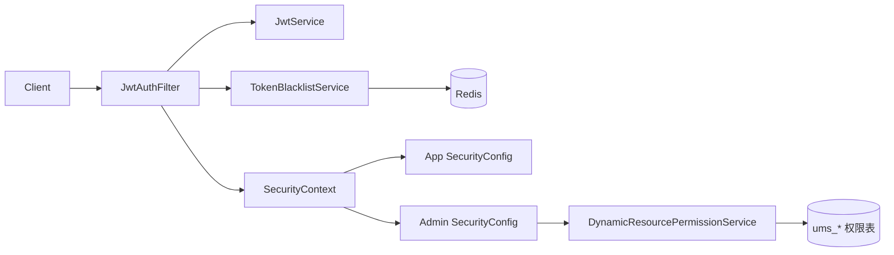

---
owner: backend
updated: 2026-02-23
scope: mall-v3
audience: dev,sec
doc_type: guide
---
# 10 - 安全指南

> 文档导航：返回 [docs/README.md](README.md)。

## 1. 安全模型概览

Mall V3 当前采用：

1. JWT 无状态认证（`JwtAuthFilter`）
2. Redis Token 黑名单（主要用于 Admin `logout`）
3. Admin 端动态 RBAC（`DynamicResourcePermissionService`）

## 2. 认证流程（事实实现）

### 2.1 登录签发

1. App 登录：`POST /sso/login`
2. Admin 登录：`POST /admin/login`
3. 返回：`token` + `tokenHead`（默认 `Bearer `）

### 2.2 请求鉴权

`JwtAuthFilter` 关键步骤：

1. 从 `Authorization` 读取 Bearer token。
2. 校验是否命中黑名单。
3. 解析用户名并写入 `SecurityContext`。
4. App 侧默认角色 `ROLE_MEMBER`，Admin 侧默认角色 `ROLE_ADMIN`。

### 2.3 刷新与登出

1. App：`GET /sso/refreshToken`（当前无服务端 logout 端点）。
2. Admin：`GET /admin/refreshToken` + `POST /admin/logout`。
3. `admin/logout` 会将未过期 token 写入黑名单（TTL=剩余有效期）。

## 3. 授权模型

### 3.1 App 端

- 公开端点白名单放行（登录、首页、商品、搜索、健康检查等）。
- 其他端点要求 `authenticated()`。

### 3.2 Admin 端

- 登录、Swagger、Actuator 公开。
- 其他端点通过 `DynamicResourcePermissionService.hasAccess(...)` 判定。
- 超级管理员 `admin` 账号直接放行。

RBAC 判定核心：

1. 匹配 `ums_resource.url`。
2. 查用户角色（`ums_admin_role_relation`）。
3. 查角色资源关系（`ums_role_resource_relation`）。
4. 有交集放行，否则 403。

## 4. 关键配置项

`mall.auth`（三服务统一）：

| 配置 | 默认值 |
|---|---|
| `token-header` | `Authorization` |
| `token-head` | `Bearer ` |
| `jwt-secret` | `${MALL_JWT_SECRET:...}` |
| `jwt-expiration-seconds` | `604800`（7 天） |

验证码服务（`AuthCodeService`）：

1. Redis key: `authCode:{identity}`
2. 验证码长度：6
3. 过期时间：300 秒
4. 验证成功后立即删除 key

## 5. CORS 现状

`CorsConfig` 当前配置：

1. `allowCredentials=true`
2. `allowedOriginPattern=*`
3. `allowedMethod=*`
4. `allowedHeader=*`
5. `exposedHeader=Authorization`

> 生产环境应收敛来源域名，避免全开策略。

## 6. 安全红线

1. 禁止硬编码密钥，统一使用 `MALL_JWT_SECRET` 注入。
2. 涉及用户数据操作必须校验资源归属（订单、地址、购物车、行为数据）。
3. 禁止在日志打印完整 token、密码、验证码。
4. SQL 必须参数化，禁止字符串拼接。

## 7. 最小审计清单

- [ ] `MALL_JWT_SECRET` 已外部注入
- [ ] Admin 资源 URL 已在 `ums_resource` 配置
- [ ] 黑名单 TTL 与 token 剩余有效期一致
- [ ] 会员关键操作都有 `memberId` 归属校验
- [ ] CORS 来源已按环境收敛
