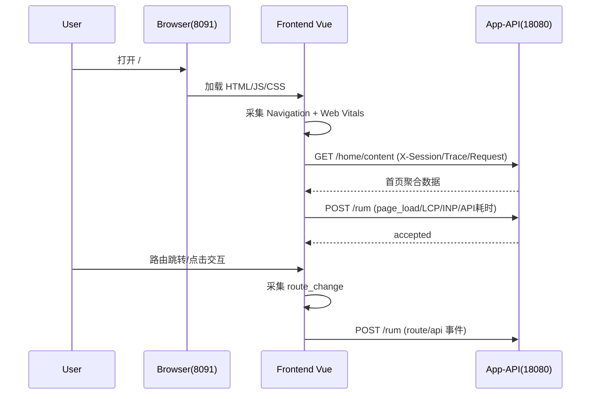

# localhost:8091 首屏卡顿排障记录（2026-02-26）

> 文档导航：返回 [docs/README.md](README.md)。

## 1. 问题背景

用户反馈：访问 `http://localhost:8091/` 时经常出现“顶部先出来，主体长时间空白，甚至几分钟无响应”。

## 2. 排障目标

1. 还原真实链路：到底卡在前端渲染、路由、接口还是图片资源。
2. 给出可复现证据：命令、网络请求、性能数据、代码定位。
3. 沉淀可交接文档：后续人员可直接复跑。

## 3. 执行环境与工作目录

1. 根目录：`D:\Desktop\work\mall`
2. 项目目录：`D:\Desktop\work\mall\project_mall_v3`
3. 终端：PowerShell 7（`pwsh`）
4. 关键服务端口：`8091`（app-web）、`18080`（app-api）

## 4. 使用的工具与用途

1. `functions.shell_command`
- 读取代码与配置
- 执行脚本日志与状态检查
- 统计接口响应体与耗时
2. `multi_tool_use.parallel`
- 并行读取多个文件/命令，加速定位
3. `mcp__chrome-devtools__*`
- 浏览器级证据采集（页面快照、Network、Console、Performance）
4. `mcp__playwright__*`
- 尝试快速复现；初次采集超时后切换到 chrome-devtools

## 5. 实际执行路径（时间线）

### 5.1 先确认“是不是服务没起来”

1. 运行 `status.ps1` / `logs.ps1` 检查服务状态与前端日志。
2. 结果：服务在跑；Vite 日志出现 `page reload src/router/index.js`。
3. 含义：当前运行入口命中了 `router/index.js`。

### 5.2 检查高危覆盖点（已知坑位）

1. 检查 `vite.config.*`：仅项目根有 `vite.config.ts`，无同级 `vite.config.js` 覆盖。
2. 检查 `router`：`src/router/index.js` 与 `src/router/index.ts` 并存。
3. 检查 `main.ts`：`import router from './router'`（无后缀）。
4. 结论：路由解析会优先命中 `.js`，存在“改 TS 但运行 JS”的风险。

### 5.3 读取首页实现，判断是否代码本身串行阻塞

1. 查看 `HomeView.vue`：`onMounted` 里首页数据加载已是并行 `Promise.allSettled`。
2. 查看模板：首页可见图片位很多（推荐、即将上架、新品、为你推荐等）。
3. 初步判断：接口串行不是主因，资源加载链路更可疑。

### 5.4 浏览器证据采集（关键）

1. 用 `chrome-devtools` 访问 `http://localhost:8091/` 并抓快照。
2. 快照显示：页面最终可完整渲染（不是永久白屏）。
3. 抓 Network：一次导航共 97 个请求，包含大量图片请求。
4. 抓 Console：无致命 JS 报错（仅表单属性 issue）。

### 5.5 针对“为什么会慢”做性能定位

1. 抓 Performance Trace：无 CPU 级长阻塞，强制回流约 91ms（非分钟级根因）。
2. 测资源耗时：本次命中缓存时请求较快，但链路设计仍存在“慢路径”。
3. 定位慢路径代码：`vite.config.ts` 自定义镜像中间件。

## 6. 关键证据（文件与行号）

### 6.1 路由高风险覆盖

1. `main.ts` 无后缀导入路由：`src/main.ts:6`
2. 路由双文件并存：
- `src/router/index.js`
- `src/router/index.ts`
3. 运行时已命中 `index.js`（Network 请求 `src/router/index.js?t=...` + Vite 日志 page reload）。

### 6.2 图片慢路径核心代码

1. 中间件入口：`frontend/apps/mall-app-web/vite.config.ts:164`
2. 本地镜像扫描：`resolveFromMirrors()` 使用同步 `fs.statSync`：`vite.config.ts:57`, `vite.config.ts:68`
3. 远程回源：`fetchAndCacheRemote()`：`vite.config.ts:81`
4. 回源超时：`setTimeout(() => controller.abort(), 10_000)`：`vite.config.ts:92`

### 6.3 首页图片量与请求量

1. 首页模板中存在多处 `` 渲染位：`HomeView.vue:60`, `HomeView.vue:98`, `HomeView.vue:400`, `HomeView.vue:429`, `HomeView.vue:458`
2. 本次页面请求总数：97（含大量 `img*.360buyimg.com` / `m.360buyimg.com`）

### 6.4 接口数据体量（实测）

1. `GET /home/content`：约 `361,814 bytes`（约 `0.35 MB`）
2. `GET /product/search?pageSize=10&sort=0`：约 `71,009 bytes`（约 `0.07 MB`）
3. 含义：首页接口并不小，但“分钟级”更可能由图片链路慢路径叠加触发。

## 7. 根因结论

### 7.1 主因（分钟级卡顿来源）

`localhost:8091` 是 Vite 开发服务器，不是生产静态站。首页图片多，且走自定义镜像中间件：

1. 先本地查镜像文件（同步 I/O）。
2. 未命中再回源外网 CDN。
3. 回源在网络差或被限速时可能触发超时（10s/张级别）。
4. 多图并发时，慢请求叠加会让用户体感接近“卡几分钟”。

### 7.2 次因（不稳定性来源）

1. `router/index.js` 与 `index.ts` 并存，入口无后缀导入，行为可漂移。
2. 首页资源位多，开发态首次访问天然比生产站慢。
3. 接口返回中包含较重字段（如详情 HTML），增加了解析与传输负担。

## 8. 本轮“解决动作”状态

1. 本轮以诊断和证据固化为主，未继续改代码。
2. 已形成可复用排障基线：
- 路由覆盖点
- 中间件慢路径
- 网络与性能证据

## 9. 后续可执行优化建议（供实施）

1. 路由入口单一化：仅保留 `src/router/index.ts`，并将 `main.ts` 改为显式 `import router from './router/index.ts'`。
2. 镜像中间件优化：
- 减少同步 `statSync` 扫描
- 为远程回源增加更强缓存与失败快速返回策略
3. 首页降载：首屏只保留必要图片区块，其余延后加载。
4. 首页接口瘦身：列表接口避免携带详情大字段。

## 10. 复现与验证命令（可直接复跑）

```powershell
# 1) 查看前端运行日志
pwsh -NoLogo -NoProfile -ExecutionPolicy Bypass -File .\project_mall_v3\scripts\logs.ps1 -Service fe-app -Lines 200

# 2) 检查路由入口与双文件
pwsh -NoLogo -NoProfile -Command "Get-Content .\project_mall_v3\frontend\apps\mall-app-web\src\main.ts"
pwsh -NoLogo -NoProfile -Command "Get-ChildItem .\project_mall_v3\frontend\apps\mall-app-web\src\router -File"

# 3) 抽查 vite 镜像中间件关键行
pwsh -NoLogo -NoProfile -Command "rg -n 'resolveFromMirrors|fs\.statSync|fetchAndCacheRemote|controller\.abort|server\.middlewares\.use' .\project_mall_v3\frontend\apps\mall-app-web\vite.config.ts"

# 4) 抽查首页图片位
pwsh -NoLogo -NoProfile -Command "rg -n '"}; (Invoke-WebRequest -UseBasicParsing -Headers $h -Uri "http://localhost:18080/home/content").Content.Length'
```

## 11. 关联文件清单

1. `frontend/apps/mall-app-web/vite.config.ts`
2. `frontend/apps/mall-app-web/src/main.ts`
3. `frontend/apps/mall-app-web/src/router/index.js`
4. `frontend/apps/mall-app-web/src/router/index.ts`
5. `frontend/apps/mall-app-web/src/views/HomeView.vue`
6. `scripts/logs.ps1`

## 12. 2026-02-27 落地：RUM + Trace 真实等待链路

### 12.1 目标

将“用户真实等待”从体感变成可查询事件：

1. 前端上报 `LCP/INP/CLS/TTFB` 与路由/API 耗时。
2. 前后端透传 `X-Session-Id`、`X-Trace-Id`、`X-Request-Id`。
3. 后端 `POST /rum` 接收事件并写入日志，供脚本与 AI 读取。

### 12.2 交互逻辑图（可验证）



### 12.3 本次接入点

1. 前端 RUM 核心：`frontend/apps/mall-app-web/src/utils/rum.ts`
2. 前端入口初始化：`frontend/apps/mall-app-web/src/main.ts`
3. 路由埋点：`frontend/apps/mall-app-web/src/router/index.ts`
4. API 透传与耗时事件：`frontend/packages/api-sdk/src/core/http.ts`
5. 后端 RUM 接口：`backend/mall-app-api/src/main/java/com/mall/app/controller/RumController.java`
6. 后端 Trace 过滤器：`backend/mall-app-api/src/main/java/com/mall/app/config/RequestTraceFilter.java`
7. 安全放通 `/rum`：`backend/mall-app-api/src/main/java/com/mall/app/config/SecurityConfig.java`

### 12.4 验收命令

```powershell
# 前端类型检查
pwsh -NoLogo -NoProfile -ExecutionPolicy Bypass -Command "Set-Location -LiteralPath 'd:/Desktop/work/mall/project_mall_v3/frontend'; pnpm --filter @mall/api-sdk type-check"
pwsh -NoLogo -NoProfile -ExecutionPolicy Bypass -Command "Set-Location -LiteralPath 'd:/Desktop/work/mall/project_mall_v3/frontend'; pnpm --filter mall-app-web type-check"

# 后端编译检查（避免 repackage 锁文件干扰）
pwsh -NoLogo -NoProfile -ExecutionPolicy Bypass -Command "Set-Location -LiteralPath 'd:/Desktop/work/mall/project_mall_v3/backend'; .\mvnw.cmd -pl mall-app-api -am -DskipTests compile -B"

# 运行后可用 logs.ps1 查看 rum_event
pwsh -NoLogo -NoProfile -ExecutionPolicy Bypass -File .\project_mall_v3\scripts\logs.ps1 -Service app -Lines 120
```
