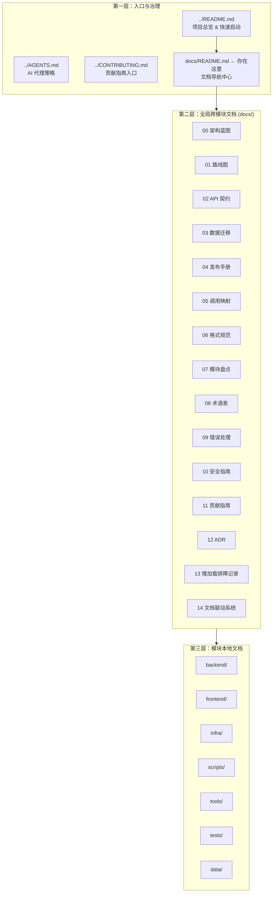

# Mall V3 — 文档中心

> **定位**：本文件是 `project_mall_v3` 的**单一文档入口**。所有文档按"分层分类"组织，确保任何信息在 30 秒内可被定位到。

---

## 快速导航

```
你是谁？          你要找什么？                    去哪里看？
─────────────    ──────────────────────       ────────────────────
新人 / 交接       项目全景 & 快速上手              → ../README.md
开发者            架构 & 模块边界                  → 00_architecture.md
开发者            接口签名 & 契约                  → 02_api_contract.md
开发者            前后端调用映射                   → 05_backend_frontend_api_usage.md
开发者            贡献规范 & 工作流                → 11_contributing.md
运维 / SRE        部署 & 回滚                     → 04_release_runbook.md
运维 / SRE        错误码 & 排障                   → 09_error_handling.md
安全              安全架构 & 认证鉴权              → 10_security_guide.md
架构师            技术决策记录 (ADR)               → 12_adr_log.md
所有人            术语表                          → 08_glossary.md
所有人            业务图谱（业务逻辑全景）         → business-atlas/README.md
所有人            文档联动系统                    → 14_doc_sync_system.md
所有人            Markdown 全量清单               → _generated/markdown_catalog.md
```

---
## 0. 本次审查快照（2026-02-25）

本次已按代码与脚本实际状态完成核对，关键基线如下：

1. 后端端点规模：`App 65`（新增 `/user/center/summary`） + `Admin 154` = `219`。
2. 前端页面规模：`mall-app-web` 视图文件 `18` 个（含 `OrderDetailView`、`JdItemView`、`UpcomingView`）。
3. 数据迁移与种子：迁移文件已到 `V9`（当前存在 `V1/V2/V3/V5/V6/V9`），种子文件 `V100~V103` 共 4 个。
4. 脚本现状：`run-tests.ps1` 仍使用历史接口路径（如 `/product/list`、`/brand/list`、`/search/simple`），不应当作为发布唯一门禁。
5. 路由现状：当前仓库未检出 `router/index.js` 影子文件；`main.ts` 当前为 `import router from './router/index'`，需继续通过 `scripts/check-shadow-js.ps1` 做防回归巡检。
6. Admin 前端配置：当前仅有 `apps/mall-admin-web/vite.config.ts`，已无同名 `vite.config.js` 覆盖问题。

---

## 1. 文档体系总览

Mall V3 采用 **"单一入口 + 分层分类 + 分布式维护"** 的文档架构，对标 Google / Microsoft 开源项目的文档工程实践。



---

## 2. 全局文档索引（docs/ 统一维护）

### 2.1 架构与设计

| # | 文档 | 定位 | 受众 | 何时更新 |
|:---:|---|---|---|---|
| 00 | [架构蓝图](00_architecture.md) | 分层架构、模块依赖、技术选型、安全架构、研发红线 | dev, arch | 跨模块流程 / 技术栈变更 |
| BA | [业务图谱](business-atlas/README.md) | 业务全景、核心流程、领域模型、数据流、证据索引 | dev,qa,ops,product,audit,user | 业务链路/页面调用/字段映射变更 |
| 08 | [术语表](08_glossary.md) | 领域术语、技术缩写、项目专有概念统一定义 | all | 新增领域概念或缩写 |
| 12 | [架构决策记录 (ADR)](12_adr_log.md) | 关键技术选型与架构决策的背景、方案对比、结论 | dev, arch | 做出重要架构决策时 |

### 2.2 开发规范

| # | 文档 | 定位 | 受众 | 何时更新 |
|:---:|---|---|---|---|
| 02 | [API 接口契约](02_api_contract.md) | App / Admin 全量端点清单与状态 | dev, qa | 接口签名 / 语义变更 |
| 05 | [前后端调用映射](05_backend_frontend_api_usage.md) | 前端页面 → SDK → 后端端点的完整映射 | dev, qa | SDK / 页面调用关系变化 |
| 06 | [文档格式规范](06_doc_style.md) | Markdown 元信息、结构、命名、书写规则 | all | 文档治理规则变更 |
| 09 | [错误处理指南](09_error_handling.md) | 错误码体系、异常分类、排障手册 | dev, ops | 错误码新增 / 异常策略变更 |
| 11 | [贡献指南](11_contributing.md) | 分支策略、提交规范、Code Review、PR 流程 | dev | 协作流程变更 |
| 14 | [文档联动系统](14_doc_sync_system.md) | 文档事实快照、联动规则、过期检测 | dev, qa, ops | 模块规模/脚本/迁移/接口基线变化 |

### 2.3 运维与安全

| # | 文档 | 定位 | 受众 | 何时更新 |
|:---:|---|---|---|---|
| 03 | [数据迁移策略](03_data_migration.md) | Flyway 策略、迁移文件语义、MongoDB 集合 | dev, ops | 迁移机制 / 脚本变化 |
| 04 | [发布运行手册](04_release_runbook.md) | 环境规划、上线检查清单、回滚策略、监控 | ops, dev | 发布流程 / 环境变化 |
| 10 | [安全指南](10_security_guide.md) | JWT 认证流程、RBAC 鉴权模型、安全红线 | dev, sec | 安全策略 / 鉴权机制变更 |
| 13 | [localhost:8091 慢加载排障记录](13_localhost_8091_slow_diagnosis_2026-02-26.md) | 性能排障证据与复现流程 | dev, ops | 出现同类性能问题时先复用 |
| 15 | [Dev vs Prod 性能差距分析](15_dev_vs_prod_gap_analysis.md) | 开发模式 vs 生产模式五维度对比、迁移方案 | dev, ops | 前端启动/部署方式变更时 |

### 2.4 项目管理

| # | 文档 | 定位 | 受众 | 何时更新 |
|:---:|---|---|---|---|
| 01 | [路线图](01_roadmap.md) | 里程碑、Phase 进度、待办事项 | all | 阶段目标变化 |
| 07 | [模块盘点与文档缺口](07_module_inventory_and_doc_gap.md) | 全量模块分析、文档补齐清单 | dev, arch | 模块新增或文档结构调整 |

---

## 3. 模块本地文档索引（就近维护）

| 模块 | 文档 | 定位 |
|---|---|---|
| 后端总览 | [`backend/README.md`](../backend/README.md) | 模块边界、依赖关系、配置与运行 |
| 领域模块 | [`backend/mall-modules/README.md`](../backend/mall-modules/README.md) | 7 个业务模块职责、调用矩阵 |
| 前端总览 | [`frontend/README.md`](../frontend/README.md) | monorepo 结构、路由、开发命令 |
| 基础设施 | [`infra/README.md`](../infra/README.md) | Docker Compose 服务清单与端口 |
| 脚本 | [`scripts/README.md`](../scripts/README.md) | 自动化脚本矩阵与使用方法 |
| 工具治理 | [`docs/tools/README.md`](tools/README.md) | 全项目脚本/工具统一清单与分类治理 |
| 数据 | [`data/README.md`](../data/README.md) | 迁移与种子文件语义 |
| 工具链 | [`tools/README.md`](../tools/README.md) | 爬取导入链路与工具说明 |
| 测试 | [`tests/README.md`](../tests/README.md) | 跨模块黑盒 / 集成测试 |
| CI/CD | [`.github/README.md`](../.github/README.md) | GitHub Actions 流水线 |
| 运行日志 | [`runtime-logs/README.md`](../runtime-logs/README.md) | 日志与产物管理 |

---

## 4. 根级文档

| 文档 | 定位 |
|---|---|
| [`README.md`](../README.md) | 项目一眼看懂、端口服务表、技术栈、启动流程 |
| [`CONTRIBUTING.md`](../CONTRIBUTING.md) | 贡献快速入门（指向 `docs/11_contributing.md` 完整版） |
| [`AGENTS.md`](../AGENTS.md) | AI 代理执行约束与策略 |

---

## 5. 文档分层原则

### 5.1 什么放 `docs/`（全局文档）

- 跨 2 个及以上模块的规则或流程
- 面向所有开发者的统一规范
- 需要跨角色（dev / qa / ops / sec）共同理解的内容

### 5.2 什么放模块目录（本地文档）

- 只对单个模块有意义的实现细节
- 模块内部的运行手册或契约
- 与代码强耦合、需随代码一起 Review 的文档

### 5.3 规则：如果你不确定放哪里

> "如果只改一个模块时需要查这份文档 → 放模块里；如果改两个以上模块时需要查 → 放 `docs/`。"

---

## 6. 变更触发矩阵

| 变更类型 | 必须更新的文档 |
|---|---|
| API 签名 / 行为变更 | `02_api_contract.md` + `api-sdk` + `05`（若涉及调用映射） |
| 跨模块业务流程变更 | `00_architecture.md`（附 Mermaid 图） |
| DB schema / 数据语义变更 | `data/migration/V{n}__*.sql` + `03_data_migration.md` |
| 错误码新增 | `09_error_handling.md` |
| 安全策略变更 | `10_security_guide.md` |
| 启动 / 部署 / 排障变更 | `04_release_runbook.md` + `scripts/README.md` |
| 爬取导入链路变更 | `tools/README.md` |
| 架构决策 | `12_adr_log.md` |
| 新增领域概念 / 缩写 | `08_glossary.md` |
| 开发流程 / 协作变更 | `11_contributing.md` + `CONTRIBUTING.md` |
| CI 流程变更 | `.github/README.md` |

---

## 7. 文档质量门禁

### 7.1 格式要求

1. 每份文档必须有 YAML frontmatter（`owner` / `updated` / `scope` / `audience` / `doc_type`）
2. 命令必须放入代码块并标注语言
3. 路径使用仓库相对路径
4. 详见 [06_doc_style.md](06_doc_style.md)

### 7.2 时效要求

- 核心文档（00–05）超过 **60 天**未更新需复核
- 辅助文档（06–14）超过 **90 天**未更新需复核
- 模块文档随代码变更同步更新

### 7.3 自动化校验

```powershell
cd d:/Desktop/work/mall/project_mall_v3
.\scripts\check-docs.ps1           # 基础格式校验
.\scripts\check-docs.ps1 -VerboseList  # 详细列表
.\scripts\check-docs.ps1 -RefreshFacts # 刷新文档事实快照（代码事实变更后执行）
```

---

## 8. 文档贡献速查

1. 新建文档 → 参考 [06_doc_style.md](06_doc_style.md) 中的模板
2. 改现有文档 → 更新 `updated` 日期
3. 新增全局文档 → 在本文件对应分类表格中添加索引行
4. 提交前 → 运行 `check-docs.ps1` 校验
