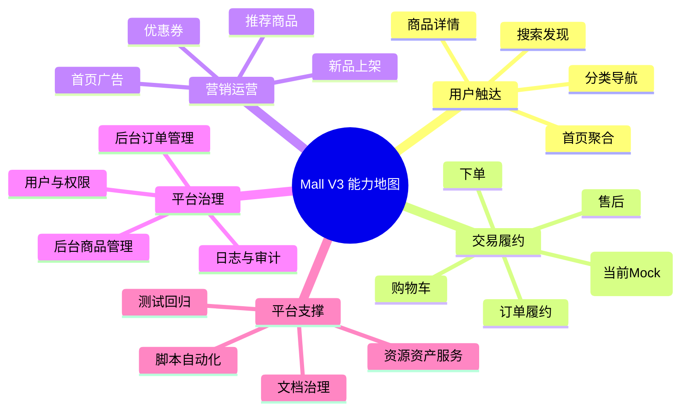

# 业务能力地图

## 1. 能力分层图

## 2. 能力到模块映射（首版）

| 能力域 | 主要模块 | 主要证据源 |
|---|---|---|
| 商品与搜索 | `module-product`、`module-search`、`mall-app-web` | `02_api_contract`、`05_backend_frontend_api_usage` |
| 交易链路 | `module-cart`、`module-oms`、`module-pms` | 控制器端点 + 测试用例 |
| 营销运营 | `module-sms`、首页聚合接口 | 首页 API 与 seed 数据 |
| 权限与后台 | `mall-admin-api`、`mall-admin-web` | Admin 契约与页面调用 |
| 基础支撑 | `scripts`、`tools`、`docsync` | 脚本 README、14 文档联动 |

## 3. 待补深度

1. 每个能力域补齐“Owner/输入/输出/SLA/异常策略”。
2. 支付与库存能力补齐目标态（当前以本地开发语义为主）。