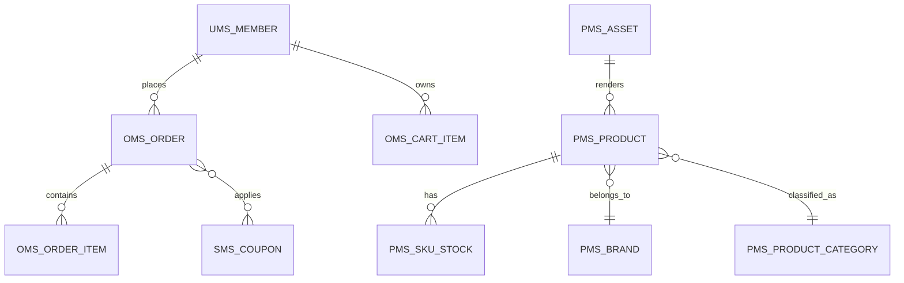

# 领域模型（首版）

## 1. 核心实体关系图

## 2. 聚合建议

- 商品聚合：`Product` + `SkuStock` + `AssetRef`
- 购物车聚合：`MemberCart` + `CartItem`
- 订单聚合：`Order` + `OrderItem` + `OrderOperateHistory`
- 营销聚合：`Coupon` + `HomeAdvertise` + `Recommend/NewProduct`

## 3. 关键状态（需继续细化）

- 订单状态：待支付 → 待发货 → 待收货 → 已完成/已关闭
- 商品状态：上架/下架 + 逻辑删除
- 资产状态：可引用/失效（当前以 hash 去重为核心）

## 4. 事实来源

- `data/migration/*.sql`
- `data/seed/*.sql`
- `backend/mall-modules/**`
- `docs/03_data_migration.md`

## 5. 待补项

1. 订单状态机与支付回调状态联动图。
2. 库存扣减与并发一致性规则。