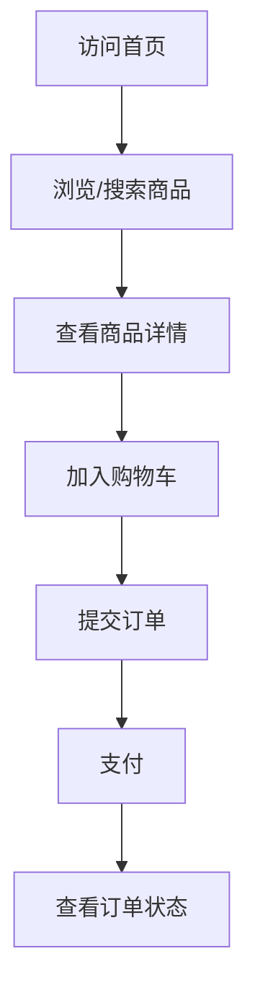
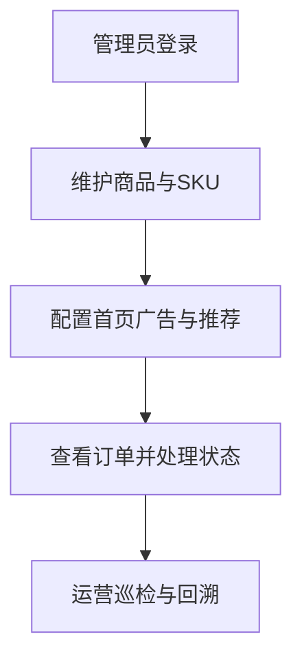

# 核心流程（用户端 + 管理端）

## 1. 用户端主链路

### 1.1 关键验证点

- 首页是否返回广告、新品、推荐与热门品类
- 详情页是否返回 SKU、规格、图文详情
- 购物车是否正确汇总促销信息
- 订单状态是否可回显

## 2. 管理端主链路

### 2.1 关键验证点

- 管理端登录与权限拦截是否生效
- 商品修改是否可在用户端可见
- 运营位配置变更是否反映在首页
- 订单后台操作与用户端状态是否一致

## 3. 事实来源

- `frontend/apps/mall-app-web/src/views/*`
- `frontend/apps/mall-admin-web/src/views/*`
- `docs/05_backend_frontend_api_usage.md`
- `docs/02_api_contract.md`

## 4. 待补项

1. 每条流程补齐异常分支（鉴权失败、库存不足、支付失败）。
2. 每条流程补齐页面级接口清单与落库点。