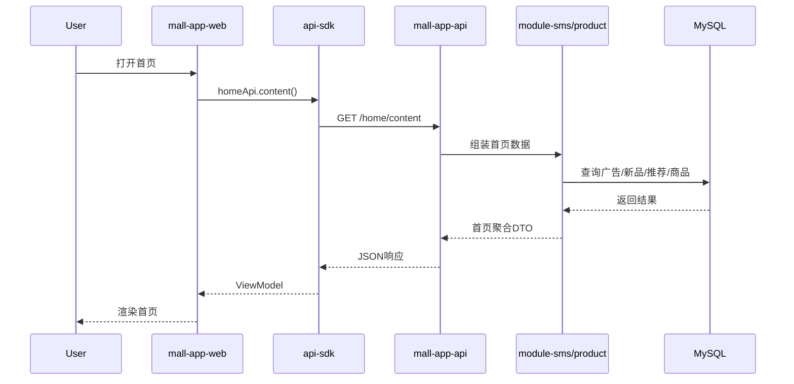
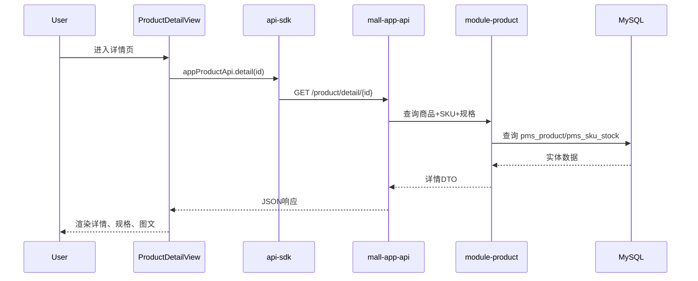

# 关键时序图（首版）

## 1. 首页聚合时序

```mermaid
sequenceDiagram
  participant U as User
  participant FE as mall-app-web
  participant SDK as api-sdk
  participant API as mall-app-api
  participant MOD as module-sms/product
  participant DB as MySQL

  U->>FE: 打开首页
  FE->>SDK: homeApi.content()
  SDK->>API: GET /home/content
  API->>MOD: 组装首页数据
  MOD->>DB: 查询广告/新品/推荐/商品
  DB-->>MOD: 返回结果
  MOD-->>API: 首页聚合DTO
  API-->>SDK: JSON响应
  SDK-->>FE: ViewModel
  FE-->>U: 渲染首页
```

## 2. 商品详情时序

```mermaid
sequenceDiagram
  participant U as User
  participant FE as ProductDetailView
  participant SDK as api-sdk
  participant API as mall-app-api
  participant MOD as module-product
  participant DB as MySQL

  U->>FE: 进入详情页
  FE->>SDK: appProductApi.detail(id)
  SDK->>API: GET /product/detail/{id}
  API->>MOD: 查询商品+SKU+规格
  MOD->>DB: 查询 pms_product/pms_sku_stock
  DB-->>MOD: 实体数据
  MOD-->>API: 详情DTO
  API-->>FE: JSON响应
  FE-->>U: 渲染详情、规格、图文
```

## 3. 待补项

1. 下单与支付完整时序。
2. 管理端商品编辑发布后的前台可见时序。